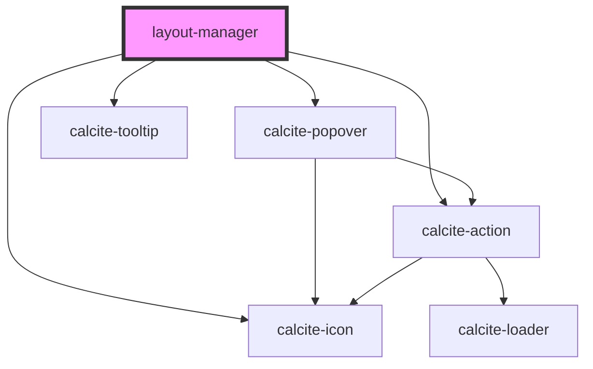

# layout-manager

<!-- Auto Generated Below -->

## Events

| Event           | Description                           | Type                                                                              |
| --------------- | ------------------------------------- | --------------------------------------------------------------------------------- |
| `layoutChanged` | Emitted when the layout should change | `CustomEvent<ELayoutMode.GRID \| ELayoutMode.HORIZONTAL \| ELayoutMode.VERTICAL>` |

## Dependencies

### Depends on

- calcite-icon
- calcite-popover
- calcite-action
- calcite-tooltip

### Graph

----------------------------------------------

*Built with [StencilJS](https://stenciljs.com/)*
