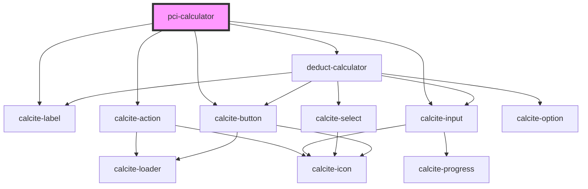

# pci-calculator

<!-- Auto Generated Below -->

## Dependencies

### Depends on

- calcite-label
- calcite-action
- [deduct-calculator](../deduct-calculator)
- calcite-input
- calcite-button

### Graph

----------------------------------------------

*Built with [StencilJS](https://stenciljs.com/)*
