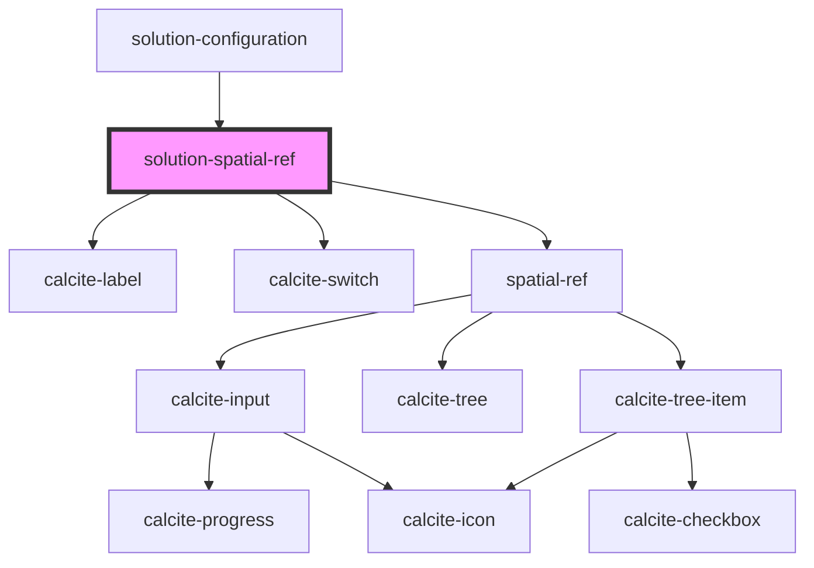

# solution-spatial-ref

<!-- Auto Generated Below -->

## Properties

| Property      | Attribute      | Description                                                                     | Type       | Default                       |
| ------------- | -------------- | ------------------------------------------------------------------------------- | ---------- | ----------------------------- |
| `defaultWkid` | `default-wkid` | The wkid that will be used as the default when no user selection has been made. | `number`   | `102100`                      |
| `locked`      | `locked`       | When true, all but the main switch are disabled to prevent interaction.         | `boolean`  | `true`                        |
| `services`    | --             | List of service names the spatial reference should apply to                     | `string[]` | `[]`                          |
| `value`       | `value`        | Contains the public value for this component, which is a wkid or a wkt.         | `string`   | `this.defaultWkid.toString()` |

## Events

| Event                                  | Description | Type                                               |
| -------------------------------------- | ----------- | -------------------------------------------------- |
| `featureServiceSpatialReferenceChange` |             | `CustomEvent<{ name: string; enabled: boolean; }>` |

## Dependencies

### Used by

 - [solution-configuration](../solution-configuration)

### Depends on

- calcite-label
- calcite-switch
- [spatial-ref](../spatial-ref)

### Graph

----------------------------------------------

*Built with [StencilJS](https://stenciljs.com/)*
