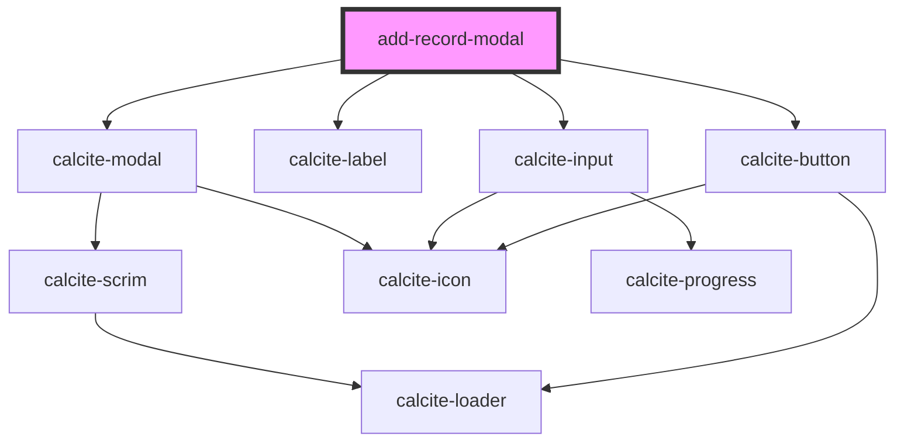

# add-record-modal

<!-- Auto Generated Below -->

## Properties

| Property | Attribute | Description                          | Type      | Default |
| -------- | --------- | ------------------------------------ | --------- | ------- |
| `open`   | `open`    | When true the component is displayed | `boolean` | `false` |

## Events

| Event         | Description                           | Type                |
| ------------- | ------------------------------------- | ------------------- |
| `modalClosed` | Emitted on demand the modal is closed | `CustomEvent<void>` |
| `modalOpened` | Emitted on demand the modal is opened | `CustomEvent<void>` |

## Dependencies

### Depends on

- calcite-modal
- calcite-label
- calcite-input
- calcite-button

### Graph

----------------------------------------------

*Built with [StencilJS](https://stenciljs.com/)*
