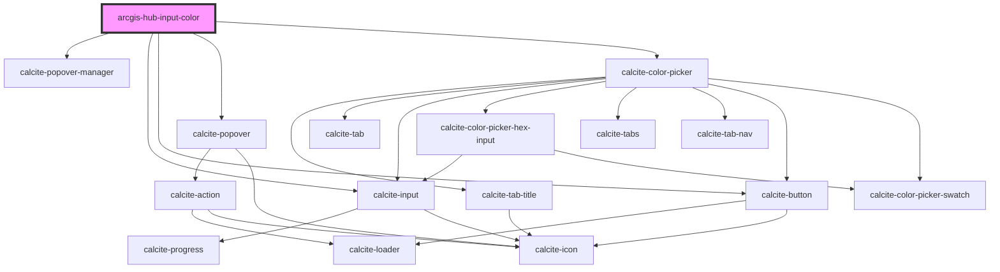

# arcgis-hub-input-color

<!-- Auto Generated Below -->

## Properties

| Property      | Attribute     | Description                                                                       | Type      | Default     |
| ------------- | ------------- | --------------------------------------------------------------------------------- | --------- | ----------- |
| `disabled`    | `disabled`    | A boolean value indicating whether the control is disabled                        | `boolean` | `false`     |
| `placeholder` | `placeholder` |                                                                                   | `string`  | `undefined` |
| `required`    | `required`    | A boolean value indicating whether the control should consider empty values valid | `boolean` | `false`     |
| `value`       | `value`       | The color                                                                         | `string`  | `undefined` |

## Events

| Event                       | Description                                             | Type                              |
| --------------------------- | ------------------------------------------------------- | --------------------------------- |
| `arcgisHubInputColorChange` | This custom event is emitted when the color is changed. | `CustomEvent<IChangeEventDetail>` |

## Dependencies

### Depends on

- calcite-popover-manager
- calcite-input
- calcite-button
- calcite-popover
- calcite-color-picker

### Graph

----------------------------------------------

*Built with [StencilJS](https://stenciljs.com/)*
