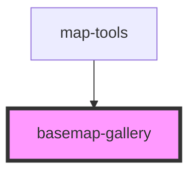

# basemap-gallery

<!-- Auto Generated Below -->

## Properties

| Property        | Attribute | Description                                                                                                                                          | Type             | Default     |
| --------------- | --------- | ---------------------------------------------------------------------------------------------------------------------------------------------------- | ---------------- | ----------- |
| `basemapWidget` | --        | esri/widgets/BasemapGallery: https://developers.arcgis.com/javascript/latest/api-reference/esri-widgets-BasemapGallery.html  BasemapGallery instance | `BasemapGallery` | `undefined` |
| `mapView`       | --        | esri/views/View: https://developers.arcgis.com/javascript/latest/api-reference/esri-views-MapView.html                                               | `MapView`        | `undefined` |

## Dependencies

### Used by

 - [map-tools](../map-tools)

### Graph

----------------------------------------------

*Built with [StencilJS](https://stenciljs.com/)*
