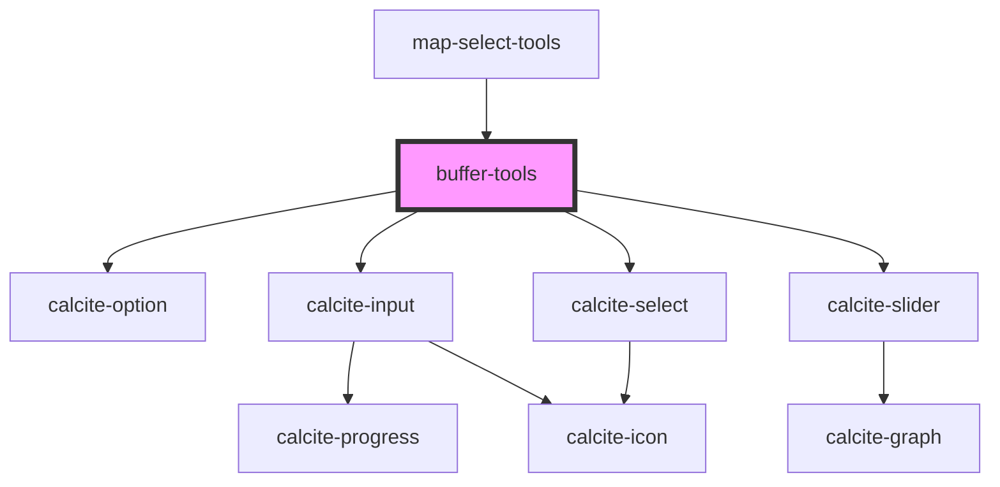

# buffer-tools

<!-- Auto Generated Below -->

## Properties

| Property       | Attribute       | Description                                                                                                       | Type                                            | Default    |
| -------------- | --------------- | ----------------------------------------------------------------------------------------------------------------- | ----------------------------------------------- | ---------- |
| `appearance`   | `appearance`    | string: The appearance of display. Can be a "slider" or "text" inputs for distance/value                          | `"slider" \| "text"`                            | `"text"`   |
| `distance`     | `distance`      | number: The distance used for buffer                                                                              | `number`                                        | `0`        |
| `geometries`   | --              | esri/geometry/Geometry: https://developers.arcgis.com/javascript/latest/api-reference/esri-geometry-Geometry.html | `Geometry[]`                                    | `[]`       |
| `sliderMax`    | `slider-max`    | number: The component's maximum selectable value.                                                                 | `number`                                        | `100`      |
| `sliderMin`    | `slider-min`    | number: The component's minimum selectable value.                                                                 | `number`                                        | `0`        |
| `sliderTicks`  | `slider-ticks`  | number: Displays tick marks on the number line at a specified interval.                                           | `number`                                        | `10`       |
| `unionResults` | `union-results` | boolean: option to control if buffer results should be unioned                                                    | `boolean`                                       | `true`     |
| `unit`         | `unit`          | DistanceUnit: "feet"\|"meters"\|"miles"\|"kilometers"                                                             | `"feet" \| "kilometers" \| "meters" \| "miles"` | `"meters"` |

## Events

| Event             | Description                                   | Type                                |
| ----------------- | --------------------------------------------- | ----------------------------------- |
| `bufferComplete`  | Emitted on demand when a buffer is generated. | `CustomEvent<Polygon \| Polygon[]>` |
| `distanceChanged` | Emitted on demand when a buffer is generated. | `CustomEvent<IValueChange>`         |
| `unitChanged`     | Emitted on demand when a buffer is generated. | `CustomEvent<IValueChange>`         |

## Dependencies

### Used by

 - [map-select-tools](../map-select-tools)

### Depends on

- calcite-option
- calcite-input
- calcite-select
- calcite-slider

### Graph

----------------------------------------------

*Built with [StencilJS](https://stenciljs.com/)*
