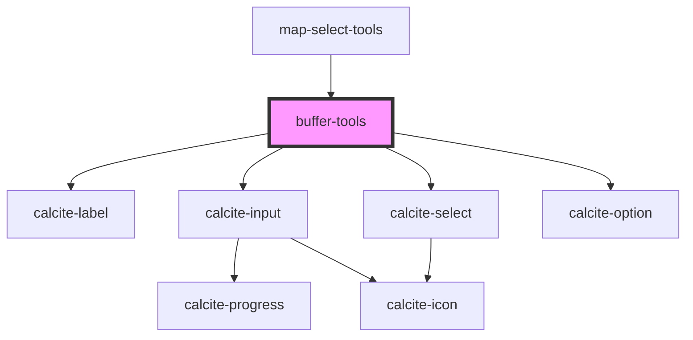

# buffer-tools

<!-- Auto Generated Below -->

## Properties

| Property       | Attribute       | Description | Type                                                                                     | Default     |
| -------------- | --------------- | ----------- | ---------------------------------------------------------------------------------------- | ----------- |
| `distance`     | `distance`      |             | `number`                                                                                 | `0`         |
| `geometries`   | --              |             | `Geometry[]`                                                                             | `undefined` |
| `translations` | `translations`  |             | `any`                                                                                    | `{}`        |
| `unionResults` | `union-results` |             | `boolean`                                                                                | `true`      |
| `unit`         | `unit`          |             | `"feet" \| "kilometers" \| "meters" \| "miles" \| "nautical-miles" \| "yards" \| number` | `undefined` |

## Events

| Event            | Description | Type               |
| ---------------- | ----------- | ------------------ |
| `bufferComplete` |             | `CustomEvent<any>` |

## Dependencies

### Used by

 - [map-select-tools](../map-select-tools)

### Depends on

- calcite-label
- calcite-input
- calcite-select
- calcite-option

### Graph

----------------------------------------------

*Built with [StencilJS](https://stenciljs.com/)*
