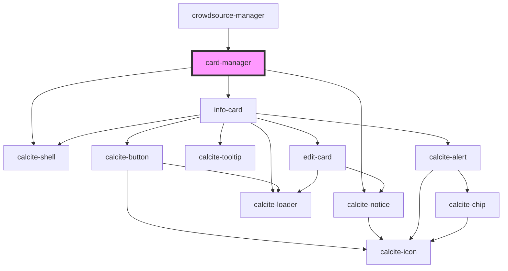

# card-manager

<!-- Auto Generated Below -->

## Properties

| Property                  | Attribute                     | Description                                                                                                                 | Type           | Default     |
| ------------------------- | ----------------------------- | --------------------------------------------------------------------------------------------------------------------------- | -------------- | ----------- |
| `layer`                   | --                            | esri/views/layers/FeatureLayer: https://developers.arcgis.com/javascript/latest/api-reference/esri-layers-FeatureLayer.html | `FeatureLayer` | `undefined` |
| `mapView`                 | --                            | esri/views/MapView: https://developers.arcgis.com/javascript/latest/api-reference/esri-views-MapView.html                   | `MapView`      | `undefined` |
| `zoomAndScrollToSelected` | `zoom-and-scroll-to-selected` | boolean: When true the selected feature will zoomed to in the map and the row will be scrolled to within the table          | `boolean`      | `undefined` |

## Dependencies

### Used by

 - [crowdsource-manager](../crowdsource-manager)

### Depends on

- calcite-shell
- [info-card](../info-card)
- calcite-notice

### Graph

----------------------------------------------

*Built with [StencilJS](https://stenciljs.com/)*
