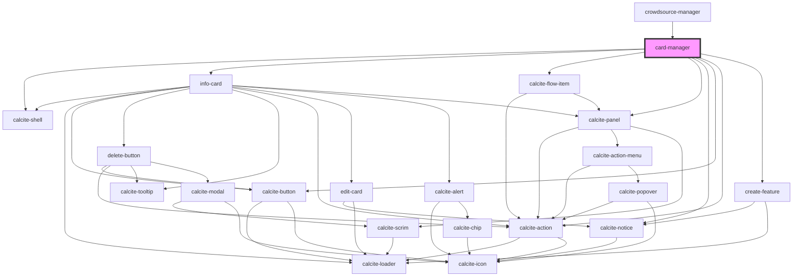

# card-manager

<!-- Auto Generated Below -->

## Properties

| Property                  | Attribute                     | Description                                                                                                                 | Type           | Default     |
| ------------------------- | ----------------------------- | --------------------------------------------------------------------------------------------------------------------------- | -------------- | ----------- |
| `customInfoText`          | `custom-info-text`            | string: custom notice text to display                                                                                       | `string`       | `undefined` |
| `enableCreateFeatures`    | `enable-create-features`      | boolean: when true the users can have the option to create features                                                         | `boolean`      | `true`      |
| `enableEditGeometry`      | `enable-edit-geometry`        | When true the geometry of the current feature will be editable                                                              | `boolean`      | `false`     |
| `isMobile`                | `is-mobile`                   | When true the component will render an optimized view for mobile devices                                                    | `boolean`      | `undefined` |
| `layer`                   | --                            | esri/views/layers/FeatureLayer: https://developers.arcgis.com/javascript/latest/api-reference/esri-layers-FeatureLayer.html | `FeatureLayer` | `undefined` |
| `mapView`                 | --                            | esri/views/MapView: https://developers.arcgis.com/javascript/latest/api-reference/esri-views-MapView.html                   | `MapView`      | `undefined` |
| `selectedFeaturesIds`     | --                            | A list of ids that are currently selected                                                                                   | `number[]`     | `undefined` |
| `selectingFeatureFromMap` | `selecting-feature-from-map`  | boolean: When select feature from map message will shown                                                                    | `boolean`      | `undefined` |
| `zoomAndScrollToSelected` | `zoom-and-scroll-to-selected` | boolean: When true the selected feature will zoomed to in the map and the row will be scrolled to within the table          | `boolean`      | `undefined` |

## Events

| Event                      | Description                            | Type                |
| -------------------------- | -------------------------------------- | ------------------- |
| `backFromCreateWorkFlow`   | Emits when back from create work flow  | `CustomEvent<void>` |
| `createWorkFlowStarted`    | Emits when create work flow started    | `CustomEvent<void>` |
| `featureOrRecordSubmitted` | Emits when feature/record is submitted | `CustomEvent<void>` |

## Dependencies

### Used by

 - [crowdsource-manager](../crowdsource-manager)

### Depends on

- calcite-shell
- [info-card](../info-card)
- calcite-flow-item
- calcite-panel
- calcite-notice
- calcite-button
- calcite-action
- [create-feature](../create-feature)

### Graph

----------------------------------------------

*Built with [StencilJS](https://stenciljs.com/)*
