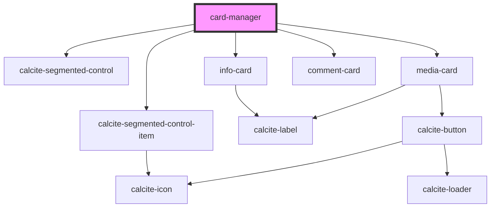

# card-manager

<!-- Auto Generated Below -->

## Properties

| Property             | Attribute              | Description                                                                                   | Type                 | Default     |
| -------------------- | ---------------------- | --------------------------------------------------------------------------------------------- | -------------------- | ----------- |
| `commentsCardValues` | `comments-card-values` | any: Still need to understand what this one will look like                                    | `any`                | `undefined` |
| `infoCardValues`     | --                     | IInfoCardValues: key value pairs to show in the info card component                           | `IInfoCardValues`    | `{}`        |
| `mediaCardValues`    | --                     | IMediaCardValues[]: Array of objects that contain the name, description, and image to display | `IMediaCardValues[]` | `[]`        |

## Dependencies

### Depends on

- calcite-segmented-control
- calcite-segmented-control-item
- [info-card](../info-card)
- [media-card](../media-card)
- [comment-card](../comment-card)

### Graph

----------------------------------------------

*Built with [StencilJS](https://stenciljs.com/)*
