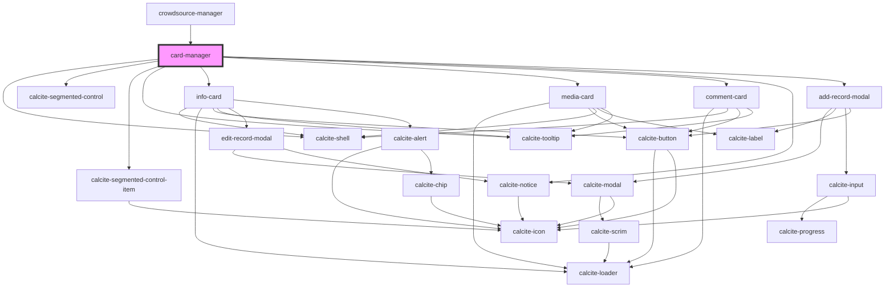

# card-manager

<!-- Auto Generated Below -->

## Properties

| Property          | Attribute | Description                                                                                                                               | Type                 | Default     |
| ----------------- | --------- | ----------------------------------------------------------------------------------------------------------------------------------------- | -------------------- | ----------- |
| `layerView`       | --        | esri/views/layers/FeatureLayerView: https://developers.arcgis.com/javascript/latest/api-reference/esri-views-layers-FeatureLayerView.html | `FeatureLayerView`   | `undefined` |
| `mapView`         | --        | esri/views/MapView: https://developers.arcgis.com/javascript/latest/api-reference/esri-views-MapView.html                                 | `MapView`            | `undefined` |
| `mediaCardValues` | --        | IMediaCardValues[]: Array of objects that contain the name, description, and image to display                                             | `IMediaCardValues[]` | `[]`        |

## Dependencies

### Used by

 - [crowdsource-manager](../crowdsource-manager)

### Depends on

- calcite-shell
- calcite-segmented-control
- calcite-segmented-control-item
- calcite-tooltip
- [info-card](../info-card)
- [media-card](../media-card)
- [comment-card](../comment-card)
- calcite-notice
- [add-record-modal](../add-record-modal)

### Graph

----------------------------------------------

*Built with [StencilJS](https://stenciljs.com/)*
