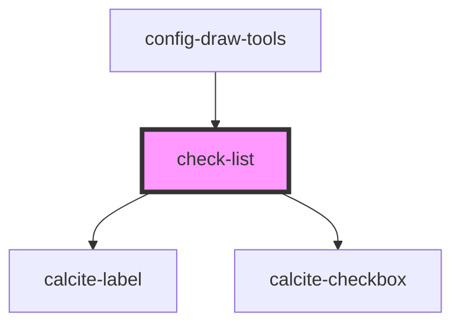

# check-list

<!-- Auto Generated Below -->

## Properties

| Property         | Attribute         | Description                                                                                        | Type       | Default     |
| ---------------- | ----------------- | -------------------------------------------------------------------------------------------------- | ---------- | ----------- |
| `defaultChecked` | `default-checked` | boolean: All checkboxes checked state will be set with this value on first render. Default is true | `boolean`  | `true`      |
| `values`         | --                | string []: The values to render beside the checkboxes                                              | `string[]` | `undefined` |

## Methods

### `getConfigInfo() => Promise<{ [key: string]: boolean; }>`

Returns a key/value pair that represents the checkbox value and checked state

#### Returns

Type: `Promise<{ [key: string]: boolean; }>`

Promise with the state of the checkboxes

## Dependencies

### Used by

 - [config-draw-tools](../config-draw-tools)

### Depends on

- calcite-label
- calcite-checkbox

### Graph

----------------------------------------------

*Built with [StencilJS](https://stenciljs.com/)*
