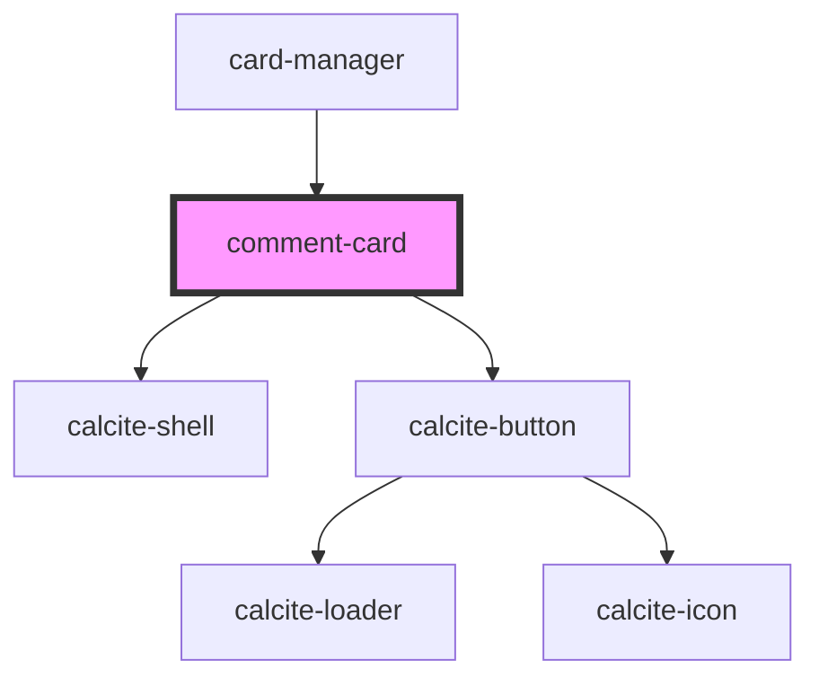

# comment-card

<!-- Auto Generated Below -->

## Properties

| Property             | Attribute              | Description | Type      | Default     |
| -------------------- | ---------------------- | ----------- | --------- | ----------- |
| `commentsCardValues` | `comments-card-values` |             | `any`     | `undefined` |
| `feature`            | --                     |             | `Feature` | `undefined` |

## Dependencies

### Used by

 - [card-manager](../card-manager)

### Depends on

- calcite-shell
- calcite-button

### Graph

----------------------------------------------

*Built with [StencilJS](https://stenciljs.com/)*
