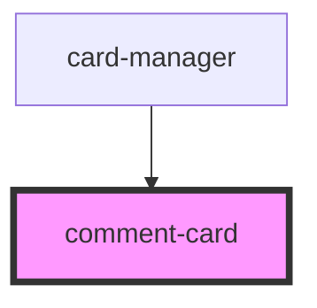

# comment-card

<!-- Auto Generated Below -->

## Properties

| Property             | Attribute              | Description | Type  | Default     |
| -------------------- | ---------------------- | ----------- | ----- | ----------- |
| `commentsCardValues` | `comments-card-values` |             | `any` | `undefined` |

## Dependencies

### Used by

 - [card-manager](../card-manager)

### Graph

----------------------------------------------

*Built with [StencilJS](https://stenciljs.com/)*
