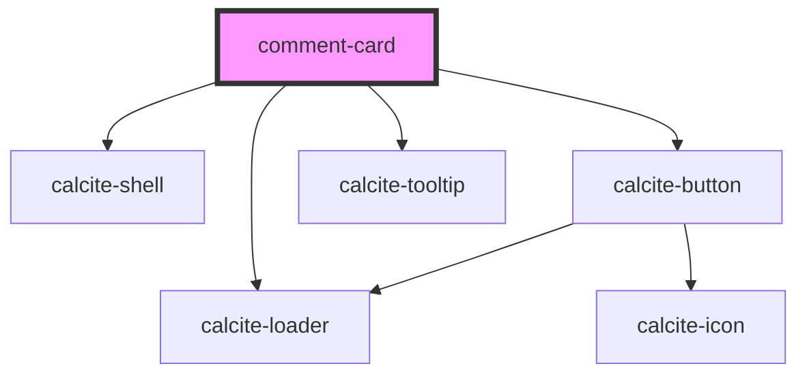

# comment-card

<!-- Auto Generated Below -->

## Properties

| Property    | Attribute    | Description                                          | Type      | Default |
| ----------- | ------------ | ---------------------------------------------------- | --------- | ------- |
| `isLoading` | `is-loading` | boolean: when true a loading indicator will be shown | `boolean` | `false` |

## Events

| Event           | Description                                                 | Type                |
| --------------- | ----------------------------------------------------------- | ------------------- |
| `openAddRecord` | Event that will trigger the opening of the add record modal | `CustomEvent<void>` |

## Dependencies

### Depends on

- calcite-loader
- calcite-shell
- calcite-button
- calcite-tooltip

### Graph

----------------------------------------------

*Built with [StencilJS](https://stenciljs.com/)*
