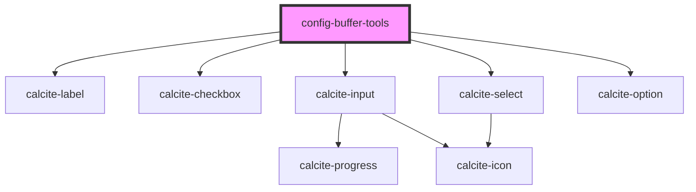

# config-buffer-tools

<!-- Auto Generated Below -->

## Properties

| Property   | Attribute  | Description                                                                                     | Type     | Default    |
| ---------- | ---------- | ----------------------------------------------------------------------------------------------- | -------- | ---------- |
| `distance` | `distance` | number: Default distance value.                                                                 | `number` | `100`      |
| `unit`     | `unit`     | string: Default unit value. Should be a unit listed in assets/t9n/config-buffer-tools/resources | `string` | `"Meters"` |

## Methods

### `getConfigInfo() => Promise<{ [key: string]: string | number; }>`

Returns a key/value pair that represents the checkbox value and checked state

#### Returns

Type: `Promise<{ [key: string]: string | number; }>`

Promise with the state of the checkboxes

## Dependencies

### Depends on

- calcite-label
- calcite-checkbox
- calcite-input
- calcite-select
- calcite-option

### Graph

----------------------------------------------

*Built with [StencilJS](https://stenciljs.com/)*
