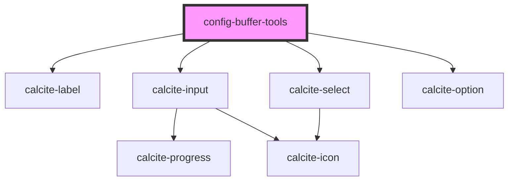

# config-buffer-tools

<!-- Auto Generated Below -->

## Properties

| Property    | Attribute   | Description                                                                                     | Type                         | Default      |
| ----------- | ----------- | ----------------------------------------------------------------------------------------------- | ---------------------------- | ------------ |
| `alignment` | `alignment` | "VERTICAL" \| "HORIZONTAL": Specifies how the controls chould be aligned.                       | `"HORIZONTAL" \| "VERTICAL"` | `"VERTICAL"` |
| `distance`  | `distance`  | number: Default distance value.                                                                 | `number`                     | `100`        |
| `unit`      | `unit`      | string: Default unit value. Should be a unit listed in assets/t9n/config-buffer-tools/resources | `string`                     | `"Meters"`   |

## Events

| Event                 | Description                                 | Type                  |
| --------------------- | ------------------------------------------- | --------------------- |
| `distanceChange`      | Emitted on demand when the distance changes | `CustomEvent<number>` |
| `unitSelectionChange` | Emitted on demand when the unit changes     | `CustomEvent<string>` |

## Dependencies

### Depends on

- calcite-label
- calcite-input
- calcite-select
- calcite-option

### Graph

----------------------------------------------

*Built with [StencilJS](https://stenciljs.com/)*
