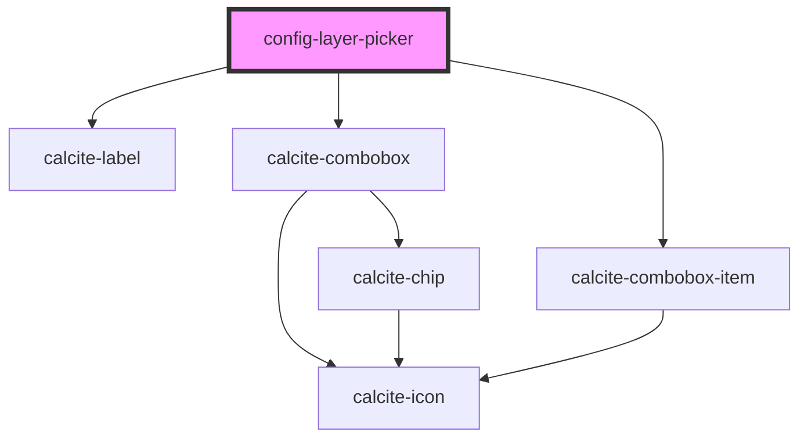

# config-layer-picker

<!-- Auto Generated Below -->

## Properties

| Property         | Attribute         | Description                                                                                            | Type      | Default     |
| ---------------- | ----------------- | ------------------------------------------------------------------------------------------------------ | --------- | ----------- |
| `defaultChecked` | `default-checked` | boolean: All checkboxes checked state will be set with this value on first render. Default is true     | `boolean` | `true`      |
| `instruction`    | `instruction`     | string: Value to be shown above the check list Allows this to support multiple sets of layers.         | `string`  | `""`        |
| `mapView`        | --                | esri/views/View: https://developers.arcgis.com/javascript/latest/api-reference/esri-views-MapView.html | `MapView` | `undefined` |

## Methods

### `getConfigInfo() => Promise<string[]>`

Returns a key/value pair that represents the checkbox value and checked state

#### Returns

Type: `Promise<string[]>`

Promise with the state of the checkboxes

## Dependencies

### Depends on

- calcite-label
- calcite-combobox
- calcite-combobox-item

### Graph

----------------------------------------------

*Built with [StencilJS](https://stenciljs.com/)*
