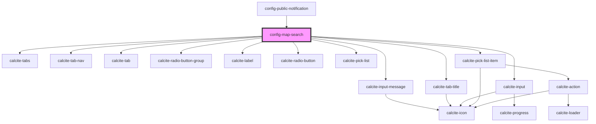

# config-map-search

<!-- Auto Generated Below -->

## Properties

| Property        | Attribute         | Description | Type      | Default |
| --------------- | ----------------- | ----------- | --------- | ------- |
| `layers`        | --                |             | `any[]`   | `[]`    |
| `useLayerUrl`   | `use-layer-url`   |             | `boolean` | `true`  |
| `useLocatorUrl` | `use-locator-url` |             | `boolean` | `true`  |

## Methods

### `getConfig() => Promise<ISearchConfig>`

#### Returns

Type: `Promise<ISearchConfig>`

## Dependencies

### Used by

 - [config-public-notification](../config-public-notification)

### Depends on

- calcite-input-message
- calcite-tabs
- calcite-tab-nav
- calcite-tab-title
- calcite-tab
- calcite-radio-button-group
- calcite-label
- calcite-radio-button
- calcite-input
- calcite-pick-list
- calcite-pick-list-item

### Graph

----------------------------------------------

*Built with [StencilJS](https://stenciljs.com/)*
