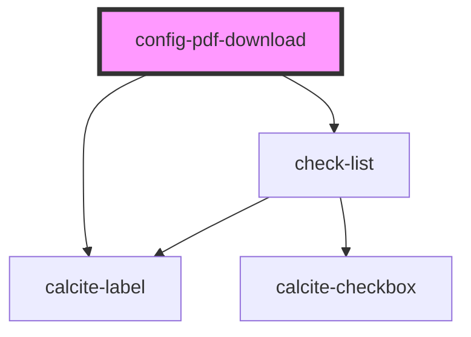

# config-pdf-download

<!-- Auto Generated Below -->

## Properties

| Property         | Attribute         | Description                                                                                        | Type      | Default |
| ---------------- | ----------------- | -------------------------------------------------------------------------------------------------- | --------- | ------- |
| `defaultChecked` | `default-checked` | boolean: All checkboxes checked state will be set with this value on first render. Default is true | `boolean` | `true`  |

## Methods

### `getConfigInfo() => Promise<{ [key: string]: boolean; }>`

Returns a key/value pair that represents the checkbox value and checked state

#### Returns

Type: `Promise<{ [key: string]: boolean; }>`

Promise with the state of the checkboxes

## Dependencies

### Depends on

- calcite-label
- [check-list](../check-list)

### Graph

----------------------------------------------

*Built with [StencilJS](https://stenciljs.com/)*
