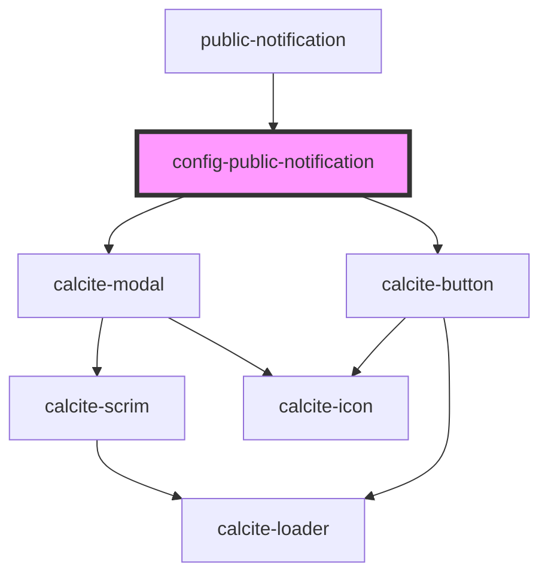

# config-public-notification

<!-- Auto Generated Below -->

## Properties

| Property       | Attribute      | Description                                   | Type      | Default |
| -------------- | -------------- | --------------------------------------------- | --------- | ------- |
| `isOpen`       | `is-open`      |                                               | `boolean` | `false` |
| `translations` | `translations` | Contains the translations for this component. | `any`     | `{}`    |

## Dependencies

### Used by

 - [public-notification](../public-notification)

### Depends on

- calcite-modal
- calcite-button

### Graph

----------------------------------------------

*Built with [StencilJS](https://stenciljs.com/)*
