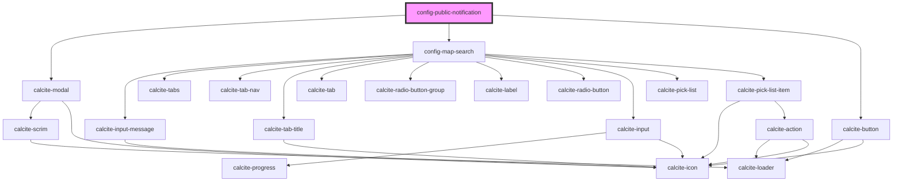

# config-public-notification

<!-- Auto Generated Below -->

## Properties

| Property       | Attribute      | Description                                                                                            | Type       | Default     |
| -------------- | -------------- | ------------------------------------------------------------------------------------------------------ | ---------- | ----------- |
| `isOpen`       | `is-open`      |                                                                                                        | `boolean`  | `false`     |
| `layerNames`   | --             |                                                                                                        | `string[]` | `[]`        |
| `mapView`      | --             | esri/views/View: https://developers.arcgis.com/javascript/latest/api-reference/esri-views-MapView.html | `MapView`  | `undefined` |
| `translations` | `translations` | Contains the translations for this component.                                                          | `any`      | `{}`        |

## Events

| Event         | Description | Type               |
| ------------- | ----------- | ------------------ |
| `configSaved` |             | `CustomEvent<any>` |

## Dependencies

### Depends on

- calcite-modal
- [config-map-search](../config-map-search)
- calcite-button

### Graph

----------------------------------------------

*Built with [StencilJS](https://stenciljs.com/)*
