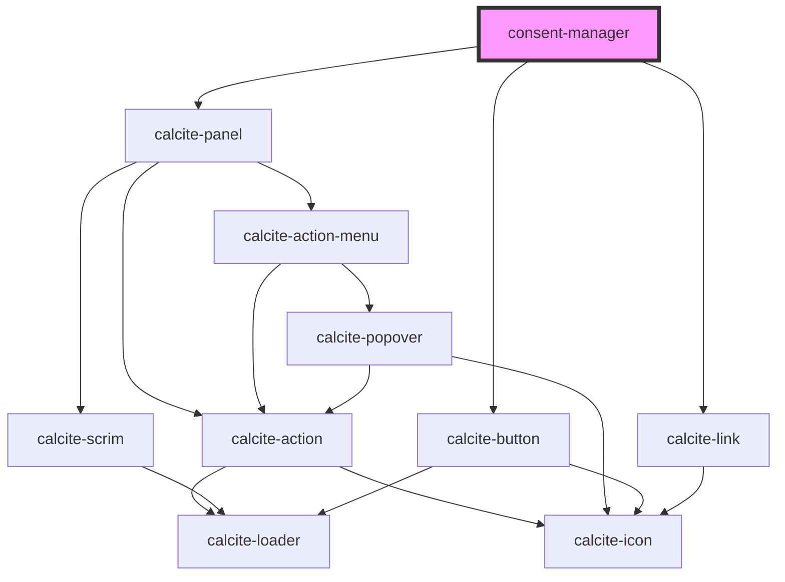

# consent-manager

<!-- Auto Generated Below -->

## Properties

| Property                      | Attribute       | Description                                                                                                                                            | Type       | Default                 |
| ----------------------------- | --------------- | ------------------------------------------------------------------------------------------------------------------------------------------------------ | ---------- | ----------------------- |
| `firstUseVar`                 | `first-use-var` | string: The name to use for the variable stored in the browsers local storge that will keep track of the users choice for consent                      | `string`   | `"solutions-first-use"` |
| `measurementIds` _(required)_ | --              | string[]: Any ids for the analytics configured to receive events from the telemety instance                                                            | `string[]` | `undefined`             |
| `portal` _(required)_         | --              | esri/portal/Portal: https://developers.arcgis.com/javascript/latest/api-reference/esri-portal-Portal.html Required prop for this component to function | `Portal`   | `undefined`             |

## Events

| Event            | Description                                               | Type                            |
| ---------------- | --------------------------------------------------------- | ------------------------------- |
| `consentGranted` | Emitted on demand when the user accepts or denies consent | `CustomEvent<IConsentResponse>` |

## Methods

### `getInstance() => Promise<Telemetry | undefined>`

Initialize and return the telemetry instance if consent has been granted

#### Returns

Type: `Promise<any>`

## Dependencies

### Depends on

- calcite-panel
- calcite-button
- calcite-link

### Graph

----------------------------------------------

*Built with [StencilJS](https://stenciljs.com/)*
