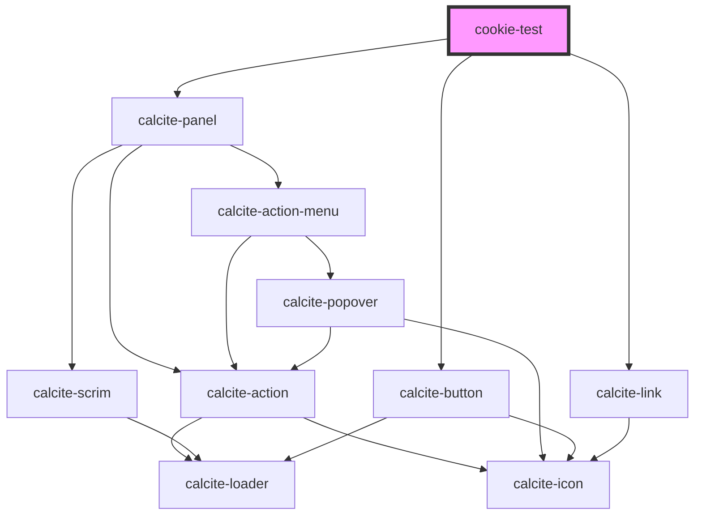

# cookie-test

<!-- Auto Generated Below -->

## Properties

| Property         | Attribute       | Description | Type       | Default                 |
| ---------------- | --------------- | ----------- | ---------- | ----------------------- |
| `firstUseVar`    | `first-use-var` |             | `string`   | `"solutions-first-use"` |
| `measurementIds` | --              |             | `string[]` | `["G-ZSDDNE856F"]`      |
| `portal`         | --              |             | `Portal`   | `undefined`             |

## Methods

### `getInstance() => Promise<Telemetry | undefined>`

#### Returns

Type: `Promise<any>`

## Dependencies

### Depends on

- calcite-panel
- calcite-button
- calcite-link

### Graph

----------------------------------------------

*Built with [StencilJS](https://stenciljs.com/)*
