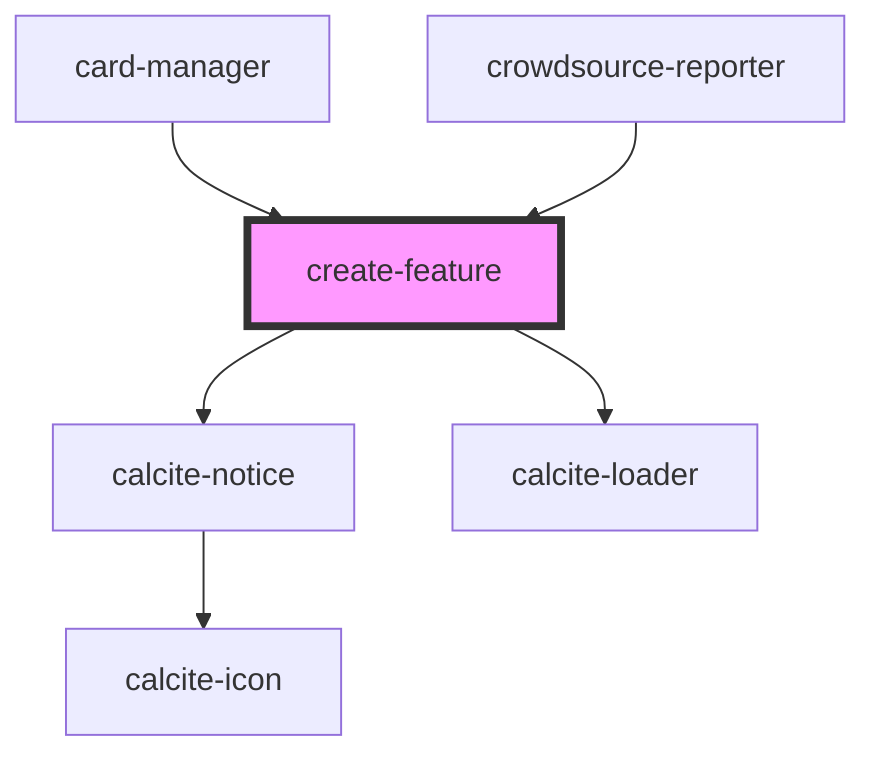

# feature-list

<!-- Auto Generated Below -->

## Properties

| Property                     | Attribute                        | Description                                                                                                                                                                              | Type                   | Default     |
| ---------------------------- | -------------------------------- | ---------------------------------------------------------------------------------------------------------------------------------------------------------------------------------------- | ---------------------- | ----------- |
| `customizeSubmit`            | `customize-submit`               | boolean: Set this to true when have a custom submit button in the app. This will hide the header and footer elements of the editor and user needs to execute the submit method manually. | `boolean`              | `false`     |
| `enableSearch`               | `enable-search`                  | boolean: When true the Search box will be displayed                                                                                                                                      | `boolean`              | `false`     |
| `floorLevel`                 | `floor-level`                    | string: selected floor level                                                                                                                                                             | `string`               | `undefined` |
| `formElements`               | `form-elements`                  | string: selected floor level                                                                                                                                                             | `any`                  | `undefined` |
| `isMobile`                   | `is-mobile`                      | boolean: When true the application will be in mobile mode, controls the mobile or desktop view                                                                                           | `boolean`              | `undefined` |
| `mapView`                    | --                               | esri/views/MapView: https://developers.arcgis.com/javascript/latest/api-reference/esri-views-MapView.html                                                                                | `MapView`              | `undefined` |
| `searchConfiguration`        | --                               | ISearchConfiguration: Configuration details for the Search widget                                                                                                                        | `ISearchConfiguration` | `undefined` |
| `selectedLayerId`            | `selected-layer-id`              | string: Layer id of the feature layer in which the new feature is to be created                                                                                                          | `string`               | `undefined` |
| `showGuidingMsg`             | `show-guiding-msg`               | boolean: When true the notice message with the current state should be shown                                                                                                             | `boolean`              | `true`      |
| `showGuidingMsgWhileDrawing` | `show-guiding-msg-while-drawing` | boolean: When false the notice message at drawing page will be hidden                                                                                                                    | `boolean`              | `true`      |

## Events

| Event               | Description                                                | Type                   |
| ------------------- | ---------------------------------------------------------- | ---------------------- |
| `drawComplete`      | Emitted on demand when drawing is completed                | `CustomEvent<void>`    |
| `editingAttachment` | Emitted on demand when editing attachments                 | `CustomEvent<boolean>` |
| `fail`              | Emitted on demand when the feature creation is failed      | `CustomEvent<Error>`   |
| `modeChanged`       | Emitted on switched form mobile to desktop or vice versa   | `CustomEvent<void>`    |
| `progressStatus`    | Emitted on demand when editor panel changes                | `CustomEvent<number>`  |
| `success`           | Emitted on demand when the feature is created successfully | `CustomEvent<void>`    |

## Methods

### `close() => Promise<void>`

Destroy the Editor widget instance

#### Returns

Type: `Promise<void>`

Promise that resolves when the operation is complete

### `refresh(floorLevel: string) => Promise<void>`

refresh the feature form

#### Parameters

| Name         | Type     | Description |
| ------------ | -------- | ----------- |
| `floorLevel` | `string` |             |

#### Returns

Type: `Promise<void>`

Promise that resolves when the operation is complete

### `submit() => Promise<void>`

Submit the created feature

#### Returns

Type: `Promise<void>`

Promise that resolves when the operation is complete

## Dependencies

### Used by

 - [card-manager](../card-manager)
 - [crowdsource-reporter](../crowdsource-reporter)

### Depends on

- calcite-notice
- calcite-loader

### Graph

----------------------------------------------

*Built with [StencilJS](https://stenciljs.com/)*
