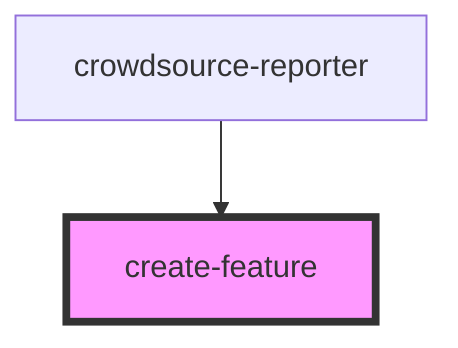

# feature-list

<!-- Auto Generated Below -->

## Properties

| Property          | Attribute           | Description | Type      | Default     |
| ----------------- | ------------------- | ----------- | --------- | ----------- |
| `mapView`         | --                  |             | `MapView` | `undefined` |
| `selectedLayerId` | `selected-layer-id` |             | `string`  | `undefined` |

## Dependencies

### Used by

 - [crowdsource-reporter](../crowdsource-reporter)

### Graph

----------------------------------------------

*Built with [StencilJS](https://stenciljs.com/)*
