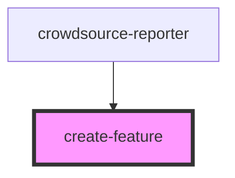

# feature-list

<!-- Auto Generated Below -->

## Properties

| Property              | Attribute           | Description                                                                                                                                                                              | Type                   | Default     |
| --------------------- | ------------------- | ---------------------------------------------------------------------------------------------------------------------------------------------------------------------------------------- | ---------------------- | ----------- |
| `customizeSubmit`     | `customize-submit`  | boolean: Set this to true when have a custom submit button in the app. This will hide the header and footer elements of the editor and user needs to execute the submit method manually. | `boolean`              | `false`     |
| `mapView`             | --                  | esri/views/MapView: https://developers.arcgis.com/javascript/latest/api-reference/esri-views-MapView.html                                                                                | `MapView`              | `undefined` |
| `searchConfiguration` | --                  | ISearchConfiguration: Configuration details for the Search widget                                                                                                                        | `ISearchConfiguration` | `undefined` |
| `selectedLayerId`     | `selected-layer-id` | string: Layer id of the feature layer in which the new feature is to be created                                                                                                          | `string`               | `undefined` |

## Events

| Event               | Description                                                | Type                   |
| ------------------- | ---------------------------------------------------------- | ---------------------- |
| `drawComplete`      | Emitted on demand when drawing is completed                | `CustomEvent<void>`    |
| `editingAttachment` | Emitted on demand when editing attachments                 | `CustomEvent<boolean>` |
| `fail`              | Emitted on demand when the feature creation is failed      | `CustomEvent<Error>`   |
| `progressStatus`    | Emitted on demand when editor panel changes                | `CustomEvent<number>`  |
| `success`           | Emitted on demand when the feature is created successfully | `CustomEvent<void>`    |

## Methods

### `close() => Promise<void>`

Destroy the Editor widget instance

#### Returns

Type: `Promise<void>`

Promise that resolves when the operation is complete

### `submit() => Promise<void>`

Submit the created feature

#### Returns

Type: `Promise<void>`

Promise that resolves when the operation is complete

## Dependencies

### Used by

 - [crowdsource-reporter](../crowdsource-reporter)

### Graph

----------------------------------------------

*Built with [StencilJS](https://stenciljs.com/)*
