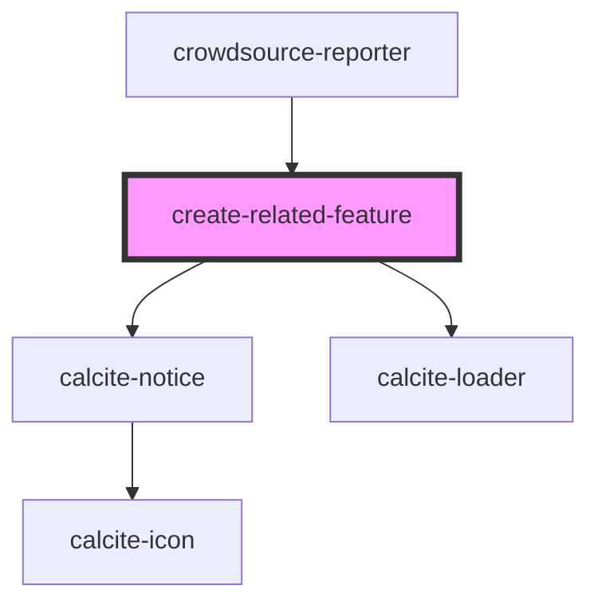

# create-related-feature

<!-- Auto Generated Below -->

## Properties

| Property          | Attribute          | Description                                                                                                                                                                              | Type           | Default     |
| ----------------- | ------------------ | ---------------------------------------------------------------------------------------------------------------------------------------------------------------------------------------- | -------------- | ----------- |
| `customizeSubmit` | `customize-submit` | boolean: Set this to true when have a custom submit button in the app. This will hide the header and footer elements of the editor and user needs to execute the submit method manually. | `boolean`      | `false`     |
| `mapView`         | --                 | esri/views/MapView: https://developers.arcgis.com/javascript/latest/api-reference/esri-views-MapView.html                                                                                | `MapView`      | `undefined` |
| `selectedFeature` | --                 | __esri.Graphic: https://developers.arcgis.com/javascript/latest/api-reference/esri-Graphic.html                                                                                          | `Graphic`      | `undefined` |
| `showGuidingMsg`  | `show-guiding-msg` | boolean: When true the notice message should be shown                                                                                                                                    | `boolean`      | `true`      |
| `table`           | --                 | __esri.FeatureLayer: https://developers.arcgis.com/javascript/latest/api-reference/esri-layers-FeatureLayer.html                                                                         | `FeatureLayer` | `undefined` |

## Events

| Event             | Description                                                  | Type                   |
| ----------------- | ------------------------------------------------------------ | ---------------------- |
| `fail`            | Emitted on demand when the comment submission is failed      | `CustomEvent<Error>`   |
| `formReady`       | Emitted on demand when form is ready                         | `CustomEvent<void>`    |
| `isActionPending` | Emitted on demand when any action is pending or completed    | `CustomEvent<boolean>` |
| `success`         | Emitted on demand when the comment is submitted successfully | `CustomEvent<void>`    |

## Methods

### `submit() => Promise<void>`

Submit the comment

#### Returns

Type: `Promise<void>`

## Dependencies

### Used by

 - [crowdsource-reporter](../crowdsource-reporter)

### Depends on

- calcite-notice
- calcite-loader

### Graph

----------------------------------------------

*Built with [StencilJS](https://stenciljs.com/)*
