# crowdsource-manager

<!-- Auto Generated Below -->

## Properties

| Property                  | Attribute                     | Description                                                                                                        | Type                   | Default     |
| ------------------------- | ----------------------------- | ------------------------------------------------------------------------------------------------------------------ | ---------------------- | ----------- |
| `classicGrid`             | `classic-grid`                | boolean: when true the grid will display like the previous manager app with the table across the top               | `boolean`              | `false`     |
| `enableAutoRefresh`       | `enable-auto-refresh`         | boolean: when true the layer table will auto refresh the data                                                      | `boolean`              | `true`      |
| `enableInlineEdit`        | `enable-inline-edit`          | boolean: when true edits can be applied directly within the table                                                  | `boolean`              | `false`     |
| `hideMap`                 | `hide-map`                    | boolean: when true no map is displayed for the app                                                                 | `boolean`              | `false`     |
| `mapInfos`                | --                            | IMapInfo[]: array of map infos (name and id)                                                                       | `IMapInfo[]`           | `[]`        |
| `searchConfiguration`     | --                            | ISearchConfiguration: Configuration details for the Search widget                                                  | `ISearchConfiguration` | `undefined` |
| `showNewestFirst`         | `show-newest-first`           | boolean: when true the table will be sorted by objectid in descending order by default                             | `boolean`              | `true`      |
| `zoomAndScrollToSelected` | `zoom-and-scroll-to-selected` | boolean: When true the selected feature will zoomed to in the map and the row will be scrolled to within the table | `boolean`              | `false`     |

## Dependencies

### Depends on

- calcite-shell
- calcite-panel
- [map-card](../map-card)
- calcite-icon
- calcite-action
- [card-manager](../card-manager)
- calcite-action-bar
- calcite-tooltip
- [layer-table](../layer-table)

### Graph

```mermaid
graph TD;
  crowdsource-manager --> calcite-shell
  crowdsource-manager --> calcite-panel
  crowdsource-manager --> map-card
  crowdsource-manager --> calcite-icon
  crowdsource-manager --> calcite-action
  crowdsource-manager --> card-manager
  crowdsource-manager --> calcite-action-bar
  crowdsource-manager --> calcite-tooltip
  crowdsource-manager --> layer-table
  calcite-panel --> calcite-action
  calcite-panel --> calcite-action-menu
  calcite-panel --> calcite-scrim
  calcite-action --> calcite-loader
  calcite-action --> calcite-icon
  calcite-action-menu --> calcite-action
  calcite-action-menu --> calcite-popover
  calcite-popover --> calcite-action
  calcite-popover --> calcite-icon
  calcite-scrim --> calcite-loader
  map-card --> map-picker
  map-card --> map-tools
  map-picker --> calcite-button
  map-picker --> calcite-action-bar
  map-picker --> calcite-list
  map-picker --> calcite-list-item
  calcite-button --> calcite-loader
  calcite-button --> calcite-icon
  calcite-action-bar --> calcite-action-group
  calcite-action-group --> calcite-action-menu
  calcite-action-group --> calcite-action
  calcite-list --> calcite-scrim
  calcite-list --> calcite-stack
  calcite-list --> calcite-filter
  calcite-filter --> calcite-input
  calcite-input --> calcite-progress
  calcite-input --> calcite-icon
  calcite-list-item --> calcite-icon
  calcite-list-item --> calcite-handle
  calcite-list-item --> calcite-action
  calcite-handle --> calcite-icon
  map-tools --> basemap-gallery
  map-tools --> map-search
  map-tools --> map-legend
  map-tools --> map-fullscreen
  map-tools --> calcite-action
  map-tools --> calcite-icon
  map-tools --> calcite-tooltip
  card-manager --> calcite-shell
  card-manager --> info-card
  card-manager --> calcite-notice
  info-card --> calcite-shell
  info-card --> calcite-loader
  info-card --> calcite-button
  info-card --> calcite-tooltip
  info-card --> edit-card
  info-card --> calcite-alert
  edit-card --> calcite-notice
  calcite-notice --> calcite-icon
  calcite-alert --> calcite-icon
  calcite-alert --> calcite-chip
  calcite-chip --> calcite-icon
  layer-table --> calcite-shell
  layer-table --> calcite-panel
  layer-table --> calcite-loader
  layer-table --> calcite-action-bar
  layer-table --> map-layer-picker
  layer-table --> calcite-action
  layer-table --> calcite-tooltip
  layer-table --> calcite-button
  layer-table --> calcite-dropdown
  layer-table --> calcite-dropdown-group
  layer-table --> calcite-dropdown-item
  layer-table --> calcite-alert
  layer-table --> calcite-scrim
  layer-table --> calcite-icon
  map-layer-picker --> calcite-select
  map-layer-picker --> calcite-combobox
  map-layer-picker --> calcite-dropdown
  map-layer-picker --> calcite-action
  map-layer-picker --> calcite-button
  map-layer-picker --> calcite-dropdown-group
  map-layer-picker --> calcite-combobox-item
  map-layer-picker --> calcite-option
  map-layer-picker --> calcite-dropdown-item
  calcite-select --> calcite-icon
  calcite-combobox --> calcite-chip
  calcite-combobox --> calcite-icon
  calcite-combobox-item --> calcite-icon
  calcite-dropdown-item --> calcite-icon
  style crowdsource-manager fill:#f9f,stroke:#333,stroke-width:4px
```

----------------------------------------------

*Built with [StencilJS](https://stenciljs.com/)*
