# crowdsource-manager

<!-- Auto Generated Below -->

## Properties

| Property   | Attribute | Description                                  | Type         | Default |
| ---------- | --------- | -------------------------------------------- | ------------ | ------- |
| `mapInfos` | --        | IMapInfo[]: array of map infos (name and id) | `IMapInfo[]` | `[]`    |

## Dependencies

### Depends on

- calcite-shell
- calcite-panel
- calcite-action
- calcite-tooltip
- [map-card](../map-card)
- [card-manager](../card-manager)
- calcite-action-bar
- [layer-table](../layer-table)

### Graph

```mermaid
graph TD;
  crowdsource-manager --> calcite-shell
  crowdsource-manager --> calcite-panel
  crowdsource-manager --> calcite-action
  crowdsource-manager --> calcite-tooltip
  crowdsource-manager --> map-card
  crowdsource-manager --> card-manager
  crowdsource-manager --> calcite-action-bar
  crowdsource-manager --> layer-table
  calcite-panel --> calcite-action
  calcite-panel --> calcite-action-menu
  calcite-panel --> calcite-scrim
  calcite-action --> calcite-loader
  calcite-action --> calcite-icon
  calcite-action-menu --> calcite-action
  calcite-action-menu --> calcite-popover
  calcite-popover --> calcite-action
  calcite-popover --> calcite-icon
  calcite-scrim --> calcite-loader
  map-card --> calcite-action-bar
  map-card --> calcite-action-group
  map-card --> calcite-action
  map-card --> calcite-icon
  map-card --> calcite-tooltip
  map-card --> calcite-block
  map-card --> calcite-list
  map-card --> calcite-list-item
  calcite-action-bar --> calcite-action-group
  calcite-action-group --> calcite-action-menu
  calcite-action-group --> calcite-action
  calcite-block --> calcite-scrim
  calcite-block --> calcite-icon
  calcite-block --> calcite-handle
  calcite-block --> calcite-loader
  calcite-block --> calcite-action-menu
  calcite-handle --> calcite-icon
  calcite-list --> calcite-scrim
  calcite-list --> calcite-filter
  calcite-filter --> calcite-input
  calcite-input --> calcite-progress
  calcite-input --> calcite-icon
  calcite-list-item --> calcite-icon
  calcite-list-item --> calcite-action
  card-manager --> calcite-shell
  card-manager --> calcite-segmented-control
  card-manager --> calcite-segmented-control-item
  card-manager --> info-card
  card-manager --> media-card
  card-manager --> comment-card
  card-manager --> add-record-modal
  calcite-segmented-control-item --> calcite-icon
  info-card --> calcite-shell
  info-card --> calcite-loader
  info-card --> calcite-button
  info-card --> edit-record-modal
  calcite-button --> calcite-loader
  calcite-button --> calcite-icon
  edit-record-modal --> calcite-modal
  edit-record-modal --> calcite-notice
  edit-record-modal --> calcite-button
  edit-record-modal --> calcite-label
  edit-record-modal --> calcite-input-text
  edit-record-modal --> calcite-input-number
  edit-record-modal --> calcite-input-date-picker
  edit-record-modal --> calcite-combobox
  edit-record-modal --> calcite-combobox-item
  calcite-modal --> calcite-scrim
  calcite-modal --> calcite-icon
  calcite-notice --> calcite-icon
  calcite-input-text --> calcite-progress
  calcite-input-text --> calcite-icon
  calcite-input-number --> calcite-progress
  calcite-input-number --> calcite-icon
  calcite-input-date-picker --> calcite-input
  calcite-input-date-picker --> calcite-date-picker
  calcite-input-date-picker --> calcite-icon
  calcite-date-picker --> calcite-date-picker-month-header
  calcite-date-picker --> calcite-date-picker-month
  calcite-date-picker-month-header --> calcite-icon
  calcite-date-picker-month --> calcite-date-picker-day
  calcite-combobox --> calcite-chip
  calcite-combobox --> calcite-icon
  calcite-chip --> calcite-icon
  calcite-combobox-item --> calcite-icon
  media-card --> calcite-loader
  media-card --> calcite-button
  media-card --> calcite-shell
  media-card --> calcite-label
  comment-card --> calcite-loader
  comment-card --> calcite-shell
  comment-card --> calcite-button
  add-record-modal --> calcite-modal
  add-record-modal --> calcite-label
  add-record-modal --> calcite-input
  add-record-modal --> calcite-button
  layer-table --> calcite-shell
  layer-table --> calcite-panel
  layer-table --> calcite-loader
  layer-table --> edit-record-modal
  layer-table --> calcite-alert
  layer-table --> calcite-link
  layer-table --> map-layer-picker
  layer-table --> calcite-action-bar
  layer-table --> calcite-action
  layer-table --> calcite-dropdown
  layer-table --> calcite-button
  layer-table --> calcite-dropdown-group
  layer-table --> calcite-dropdown-item
  calcite-alert --> calcite-icon
  calcite-alert --> calcite-chip
  calcite-link --> calcite-icon
  map-layer-picker --> calcite-select
  map-layer-picker --> calcite-combobox
  map-layer-picker --> calcite-dropdown
  map-layer-picker --> calcite-button
  map-layer-picker --> calcite-dropdown-group
  map-layer-picker --> calcite-dropdown-item
  map-layer-picker --> calcite-option
  map-layer-picker --> calcite-combobox-item
  calcite-select --> calcite-icon
  calcite-dropdown-item --> calcite-icon
  style crowdsource-manager fill:#f9f,stroke:#333,stroke-width:4px
```

----------------------------------------------

*Built with [StencilJS](https://stenciljs.com/)*
