# crowdsource-manager

<!-- Auto Generated Below -->

## Properties

| Property                    | Attribute                       | Description                                                                                                                                                                                                                                                                                        | Type                                      | Default     |
| --------------------------- | ------------------------------- | -------------------------------------------------------------------------------------------------------------------------------------------------------------------------------------------------------------------------------------------------------------------------------------------------- | ----------------------------------------- | ----------- |
| `appLayout`                 | `app-layout`                    | AppLayout: The type of layout the application should use. Valid values: "mapView" or "tableView" or "splitView"                                                                                                                                                                                    | `"mapView" \| "splitView" \| "tableView"` | `undefined` |
| `appProxies`                | `app-proxies`                   | Array of objects containing proxy information for premium platform services.                                                                                                                                                                                                                       | `any`                                     | `undefined` |
| `basemapConfig`             | --                              | IBasemapConfig: List of any basemaps to filter out from the basemap widget                                                                                                                                                                                                                         | `IBasemapConfig`                          | `undefined` |
| `coverPageEnabled`          | `cover-page-enabled`            | boolean: When true a cover page has been enabled in the consuming application. Also when true a floating button will be shown in the lower right of the window that will emit an event when clicked that the consuming application can respond to that will open the cover page.                   | `boolean`                                 | `undefined` |
| `customInfoText`            | `custom-info-text`              | string: custom notification text to display in the card manager                                                                                                                                                                                                                                    | `string`                                  | `undefined` |
| `defaultCenter`             | `default-center`                | string: default center point values for the map ; delimited x;y pair                                                                                                                                                                                                                               | `string`                                  | `""`        |
| `defaultGlobalId`           | `default-global-id`             | string: Global ID of the feature to select                                                                                                                                                                                                                                                         | `string`                                  | `""`        |
| `defaultLayer`              | `default-layer`                 | string: when provided this layer ID will be used when the app loads                                                                                                                                                                                                                                | `string`                                  | `""`        |
| `defaultLevel`              | `default-level`                 | string: default zoom level                                                                                                                                                                                                                                                                         | `string`                                  | `""`        |
| `defaultOid`                | `default-oid`                   | string: Object ID of feature to select                                                                                                                                                                                                                                                             | `string`                                  | `""`        |
| `defaultWebmap`             | `default-webmap`                | string: Item ID of the web map that should be selected by default                                                                                                                                                                                                                                  | `string`                                  | `""`        |
| `enableAutoRefresh`         | `enable-auto-refresh`           | boolean: when true the layer table will auto refresh the data                                                                                                                                                                                                                                      | `boolean`                                 | `false`     |
| `enableBasemap`             | `enable-basemap`                | boolean: when true the basemap widget will be available                                                                                                                                                                                                                                            | `boolean`                                 | `true`      |
| `enableCSV`                 | `enable-c-s-v`                  | boolean: when true the export to csv button will be available                                                                                                                                                                                                                                      | `boolean`                                 | `true`      |
| `enableColumnReorder`       | `enable-column-reorder`         | boolean: when true the layer table will support drag/drop of columns to adjust order                                                                                                                                                                                                               | `boolean`                                 | `true`      |
| `enableFloorFilter`         | `enable-floor-filter`           | boolean: when true the fullscreen widget will be available                                                                                                                                                                                                                                         | `boolean`                                 | `true`      |
| `enableFullscreen`          | `enable-fullscreen`             | boolean: when true the fullscreen widget will be available                                                                                                                                                                                                                                         | `boolean`                                 | `true`      |
| `enableHome`                | `enable-home`                   | boolean: when true the home widget will be available                                                                                                                                                                                                                                               | `boolean`                                 | `true`      |
| `enableLegend`              | `enable-legend`                 | boolean: when true the legend widget will be available                                                                                                                                                                                                                                             | `boolean`                                 | `true`      |
| `enableSearch`              | `enable-search`                 | boolean: when true the search widget will be available                                                                                                                                                                                                                                             | `boolean`                                 | `true`      |
| `enableShare`               | `enable-share`                  | boolean: when true the share widget will be available                                                                                                                                                                                                                                              | `boolean`                                 | `false`     |
| `enableZoom`                | `enable-zoom`                   | boolean: when true the zoom widget will be available                                                                                                                                                                                                                                               | `boolean`                                 | `true`      |
| `hideMapOnLoad`             | `hide-map-on-load`              | boolean: when true the map will be hidden on load                                                                                                                                                                                                                                                  | `boolean`                                 | `false`     |
| `introductionWindowEnabled` | `introduction-window-enabled`   | boolean: When true a introduction window has been enabled in the consuming application. Also when true a floating button will be shown in the lower right of the window that will emit an event when clicked that the consuming application can respond to that will open the introduction window. | `boolean`                                 | `false`     |
| `mapInfos`                  | --                              | IMapInfo[]: array of map infos (name and id)                                                                                                                                                                                                                                                       | `IMapInfo[]`                              | `[]`        |
| `onlyShowUpdatableLayers`   | `only-show-updatable-layers`    | boolean: When true only editable layers that support the update capability will be available                                                                                                                                                                                                       | `boolean`                                 | `true`      |
| `popupHeaderColor`          | `popup-header-color`            | string: The background color to apply to the popup header                                                                                                                                                                                                                                          | `string`                                  | `undefined` |
| `popupHeaderHoverColor`     | `popup-header-hover-color`      | string: The color that will be displayed on hover when expanding the popup header                                                                                                                                                                                                                  | `string`                                  | `undefined` |
| `popupHeaderHoverTextColor` | `popup-header-hover-text-color` | string: The font color that will be displayed on hover when expanding the popup header                                                                                                                                                                                                             | `string`                                  | `undefined` |
| `popupHeaderTextColor`      | `popup-header-text-color`       | string: The font color to apply to the popup header                                                                                                                                                                                                                                                | `string`                                  | `undefined` |
| `searchConfiguration`       | --                              | ISearchConfiguration: Configuration details for the Search widget                                                                                                                                                                                                                                  | `ISearchConfiguration`                    | `undefined` |
| `shareIncludeEmbed`         | `share-include-embed`           | boolean: When true the share options will include embed option                                                                                                                                                                                                                                     | `boolean`                                 | `undefined` |
| `shareIncludeSocial`        | `share-include-social`          | boolean: When true the share options will include social media sharing                                                                                                                                                                                                                             | `boolean`                                 | `undefined` |
| `showNewestFirst`           | `show-newest-first`             | boolean: when true the table will be sorted by objectid in descending order by default                                                                                                                                                                                                             | `boolean`                                 | `true`      |
| `theme`                     | `theme`                         | theme: "light" \| "dark" theme to be used                                                                                                                                                                                                                                                          | `"dark" \| "light"`                       | `"light"`   |
| `zoomAndScrollToSelected`   | `zoom-and-scroll-to-selected`   | boolean: When true the selected feature will zoomed to in the map and the row will be scrolled to within the table                                                                                                                                                                                 | `boolean`                                 | `false`     |
| `zoomToScale`               | `zoom-to-scale`                 | number: default scale to zoom to when zooming to a single point feature                                                                                                                                                                                                                            | `number`                                  | `undefined` |

## Events

| Event                    | Description                                           | Type                |
| ------------------------ | ----------------------------------------------------- | ------------------- |
| `showCoverPage`          | Emitted on demand when a cover page button is clicked | `CustomEvent<void>` |
| `showIntroductionWindow` | Emitted on demand when a info button is clicked       | `CustomEvent<void>` |

## Dependencies

### Depends on

- calcite-shell
- calcite-panel
- calcite-button
- [delete-button](../delete-button)
- [map-card](../map-card)
- calcite-icon
- [card-manager](../card-manager)
- calcite-action-bar
- [layer-table](../layer-table)
- calcite-action
- calcite-tooltip
- calcite-modal
- instant-apps-filter-list

### Graph

```mermaid
graph TD;
  crowdsource-manager --> calcite-shell
  crowdsource-manager --> calcite-panel
  crowdsource-manager --> calcite-button
  crowdsource-manager --> delete-button
  crowdsource-manager --> map-card
  crowdsource-manager --> calcite-icon
  crowdsource-manager --> card-manager
  crowdsource-manager --> calcite-action-bar
  crowdsource-manager --> layer-table
  crowdsource-manager --> calcite-action
  crowdsource-manager --> calcite-tooltip
  crowdsource-manager --> calcite-modal
  crowdsource-manager --> instant-apps-filter-list
  calcite-panel --> calcite-action
  calcite-panel --> calcite-action-menu
  calcite-panel --> calcite-scrim
  calcite-action --> calcite-loader
  calcite-action --> calcite-icon
  calcite-action-menu --> calcite-action
  calcite-action-menu --> calcite-popover
  calcite-popover --> calcite-action
  calcite-popover --> calcite-icon
  calcite-scrim --> calcite-loader
  calcite-button --> calcite-loader
  calcite-button --> calcite-icon
  delete-button --> calcite-button
  delete-button --> calcite-action
  delete-button --> calcite-tooltip
  delete-button --> calcite-modal
  calcite-modal --> calcite-scrim
  calcite-modal --> calcite-icon
  map-card --> map-tools
  map-card --> calcite-action-bar
  map-card --> map-picker
  map-card --> map-layer-picker
  map-card --> calcite-dropdown
  map-card --> calcite-action
  map-card --> calcite-button
  map-card --> calcite-dropdown-group
  map-card --> calcite-dropdown-item
  map-card --> calcite-loader
  map-card --> calcite-tooltip
  map-tools --> basemap-gallery
  map-tools --> map-search
  map-tools --> map-legend
  map-tools --> map-fullscreen
  map-tools --> floor-filter
  map-tools --> calcite-action
  map-tools --> calcite-icon
  map-tools --> calcite-tooltip
  calcite-action-bar --> calcite-action-group
  calcite-action-group --> calcite-action-menu
  calcite-action-group --> calcite-action
  map-picker --> calcite-button
  map-picker --> calcite-tooltip
  map-picker --> calcite-action-bar
  map-picker --> calcite-list
  map-picker --> calcite-list-item
  calcite-list --> calcite-scrim
  calcite-list --> calcite-stack
  calcite-list --> calcite-filter
  calcite-filter --> calcite-input
  calcite-input --> calcite-progress
  calcite-input --> calcite-icon
  calcite-list-item --> calcite-icon
  calcite-list-item --> calcite-handle
  calcite-list-item --> calcite-action
  calcite-handle --> calcite-icon
  map-layer-picker --> calcite-notice
  map-layer-picker --> calcite-tooltip
  map-layer-picker --> calcite-icon
  map-layer-picker --> calcite-label
  map-layer-picker --> calcite-select
  map-layer-picker --> calcite-combobox
  map-layer-picker --> calcite-dropdown
  map-layer-picker --> calcite-dropdown-group
  map-layer-picker --> calcite-action
  map-layer-picker --> calcite-button
  map-layer-picker --> calcite-combobox-item
  map-layer-picker --> calcite-option
  map-layer-picker --> calcite-dropdown-item
  calcite-notice --> calcite-icon
  calcite-select --> calcite-icon
  calcite-combobox --> calcite-combobox-item
  calcite-combobox --> calcite-chip
  calcite-combobox --> calcite-icon
  calcite-combobox-item --> calcite-icon
  calcite-chip --> calcite-icon
  calcite-dropdown-item --> calcite-icon
  card-manager --> calcite-shell
  card-manager --> info-card
  card-manager --> calcite-flow-item
  card-manager --> calcite-panel
  card-manager --> calcite-notice
  card-manager --> calcite-button
  card-manager --> calcite-action
  card-manager --> create-feature
  info-card --> calcite-shell
  info-card --> calcite-loader
  info-card --> calcite-button
  info-card --> delete-button
  info-card --> calcite-tooltip
  info-card --> calcite-action
  info-card --> edit-card
  info-card --> calcite-alert
  info-card --> calcite-panel
  edit-card --> calcite-notice
  edit-card --> calcite-loader
  calcite-alert --> calcite-icon
  calcite-alert --> calcite-chip
  calcite-flow-item --> calcite-action
  calcite-flow-item --> calcite-panel
  create-feature --> calcite-notice
  create-feature --> calcite-loader
  layer-table --> calcite-shell
  layer-table --> calcite-panel
  layer-table --> calcite-input
  layer-table --> calcite-loader
  layer-table --> calcite-action-bar
  layer-table --> map-layer-picker
  layer-table --> calcite-dropdown
  layer-table --> calcite-dropdown-group
  layer-table --> calcite-dropdown-item
  layer-table --> calcite-action
  layer-table --> calcite-button
  layer-table --> instant-apps-social-share
  layer-table --> calcite-tooltip
  layer-table --> delete-button
  layer-table --> calcite-modal
  layer-table --> instant-apps-filter-list
  instant-apps-social-share --> calcite-popover
  instant-apps-social-share --> calcite-button
  instant-apps-social-share --> calcite-icon
  instant-apps-social-share --> calcite-action
  instant-apps-filter-list --> calcite-panel
  instant-apps-filter-list --> calcite-loader
  instant-apps-filter-list --> calcite-checkbox
  instant-apps-filter-list --> calcite-block
  instant-apps-filter-list --> calcite-combobox
  instant-apps-filter-list --> calcite-combobox-item
  instant-apps-filter-list --> calcite-slider
  instant-apps-filter-list --> calcite-input-date-picker
  instant-apps-filter-list --> calcite-action
  instant-apps-filter-list --> calcite-button
  calcite-block --> calcite-scrim
  calcite-block --> calcite-loader
  calcite-block --> calcite-icon
  calcite-block --> calcite-handle
  calcite-block --> calcite-action-menu
  calcite-slider --> calcite-graph
  calcite-input-date-picker --> calcite-input-text
  calcite-input-date-picker --> calcite-date-picker
  calcite-input-date-picker --> calcite-icon
  calcite-input-text --> calcite-progress
  calcite-input-text --> calcite-icon
  calcite-date-picker --> calcite-date-picker-month-header
  calcite-date-picker --> calcite-date-picker-month
  calcite-date-picker-month-header --> calcite-icon
  calcite-date-picker-month --> calcite-date-picker-day
  style crowdsource-manager fill:#f9f,stroke:#333,stroke-width:4px
```

----------------------------------------------

*Built with [StencilJS](https://stenciljs.com/)*
