# crowdsource-reporter

<!-- Auto Generated Below -->

## Properties

| Property                      | Attribute                          | Description                                                                                               | Type                   | Default     |
| ----------------------------- | ---------------------------------- | --------------------------------------------------------------------------------------------------------- | ---------------------- | ----------- |
| `center`                      | `center`                           | string: Semicolon delimited numbers that will be used as the maps center point from URL params            | `string`               | `undefined` |
| `defaultWebmap`               | `default-webmap`                   | string: Item ID of the web map that should be selected by default                                         | `string`               | `""`        |
| `description`                 | `description`                      | string: The text that will display under the title on the landing page                                    | `string`               | `undefined` |
| `enableAnonymousAccess`       | `enable-anonymous-access`          | boolean: When true the anonymous users will be allowed to submit reports and comments                     | `boolean`              | `undefined` |
| `enableAnonymousComments`     | `enable-anonymous-comments`        | boolean: When true the anonymous users will be allowed to submit comments                                 | `boolean`              | `undefined` |
| `enableComments`              | `enable-comments`                  | boolean: When true the user will be allowed to submit comments                                            | `boolean`              | `undefined` |
| `enableHome`                  | `enable-home`                      | boolean: when true the home widget will be available                                                      | `boolean`              | `true`      |
| `enableLogin`                 | `enable-login`                     | boolean: When true the user will be provided a login page                                                 | `boolean`              | `undefined` |
| `enableNewReports`            | `enable-new-reports`               | boolean: When true the user will be allowed to submit new reports                                         | `boolean`              | `undefined` |
| `enableSearch`                | `enable-search`                    | boolean: when true the search widget will be available                                                    | `boolean`              | `true`      |
| `enableZoom`                  | `enable-zoom`                      | boolean: when true the zoom widget will be available                                                      | `boolean`              | `true`      |
| `isMobile`                    | `is-mobile`                        | boolean: When true the application will be in mobile mode, controls the mobile or desktop view            | `boolean`              | `undefined` |
| `layerExpressions`            | --                                 | ILayerExpression[]: Array of layer expressions for layers (filter configuration)                          | `ILayerExpression[]`   | `[]`        |
| `layerId`                     | `layer-id`                         | string: Layer id of the feature from URL params                                                           | `string`               | `undefined` |
| `level`                       | `level`                            | string: Id of the zoom level from URL params                                                              | `string`               | `undefined` |
| `loginTitle`                  | `login-title`                      | string: The text that will display at the top of the landing page                                         | `string`               | `undefined` |
| `mapInfos`                    | --                                 | IMapInfo[]: array of map infos (name and id)                                                              | `IMapInfo[]`           | `[]`        |
| `mapView`                     | --                                 | esri/views/MapView: https://developers.arcgis.com/javascript/latest/api-reference/esri-views-MapView.html | `MapView`              | `undefined` |
| `objectId`                    | `object-id`                        | string: Object id of the feature from URL params                                                          | `string`               | `undefined` |
| `reportButtonText`            | `report-button-text`               | string: The word(s) to display in the reports submit button                                               | `string`               | `undefined` |
| `reportSubmittedMessage`      | `report-submitted-message`         | string: The message to display when the report has been submitted                                         | `string`               | `undefined` |
| `reportingOptions`            | --                                 | IReportingOptions: Key options for reporting                                                              | `IReportingOptions`    | `undefined` |
| `reportsHeader`               | `reports-header`                   | string: The word(s) to display in the reports header                                                      | `string`               | `undefined` |
| `searchConfiguration`         | --                                 | ISearchConfiguration: Configuration details for the Search widget                                         | `ISearchConfiguration` | `undefined` |
| `showComments`                | `show-comments`                    | boolean: When true the comments from all users will be visible                                            | `boolean`              | `undefined` |
| `showUserImageInCommentsList` | `show-user-image-in-comments-list` | boolean: When true the profile image of the comment creator will be shown in the comments list            | `boolean`              | `false`     |
| `theme`                       | `theme`                            | theme: "light" \| "dark" theme to be used                                                                 | `"dark" \| "light"`    | `"light"`   |
| `zoomToScale`                 | `zoom-to-scale`                    | number: default scale to zoom to when zooming to a single point feature                                   | `number`               | `undefined` |

## Events

| Event         | Description                                             | Type                                                         |
| ------------- | ------------------------------------------------------- | ------------------------------------------------------------ |
| `togglePanel` | Emitted when toggle panel button is clicked in reporter | `CustomEvent<{ panelState: boolean; isFormOpen: boolean; }>` |

## Dependencies

### Depends on

- calcite-alert
- calcite-shell
- calcite-panel
- calcite-flow
- calcite-loader
- calcite-modal
- instant-apps-filter-list
- calcite-popover
- calcite-list
- calcite-list-item
- calcite-flow-item
- calcite-button
- [layer-list](../layer-list)
- calcite-progress
- calcite-notice
- [create-feature](../create-feature)
- calcite-action
- [feature-list](../feature-list)
- instant-apps-social-share
- [feature-details](../feature-details)
- calcite-tooltip
- [info-card](../info-card)
- [create-related-feature](../create-related-feature)

### Graph

```mermaid
graph TD;
  crowdsource-reporter --> calcite-alert
  crowdsource-reporter --> calcite-shell
  crowdsource-reporter --> calcite-panel
  crowdsource-reporter --> calcite-flow
  crowdsource-reporter --> calcite-loader
  crowdsource-reporter --> calcite-modal
  crowdsource-reporter --> instant-apps-filter-list
  crowdsource-reporter --> calcite-popover
  crowdsource-reporter --> calcite-list
  crowdsource-reporter --> calcite-list-item
  crowdsource-reporter --> calcite-flow-item
  crowdsource-reporter --> calcite-button
  crowdsource-reporter --> layer-list
  crowdsource-reporter --> calcite-progress
  crowdsource-reporter --> calcite-notice
  crowdsource-reporter --> create-feature
  crowdsource-reporter --> calcite-action
  crowdsource-reporter --> feature-list
  crowdsource-reporter --> instant-apps-social-share
  crowdsource-reporter --> feature-details
  crowdsource-reporter --> calcite-tooltip
  crowdsource-reporter --> info-card
  crowdsource-reporter --> create-related-feature
  calcite-alert --> calcite-icon
  calcite-alert --> calcite-chip
  calcite-chip --> calcite-icon
  calcite-panel --> calcite-action
  calcite-panel --> calcite-action-menu
  calcite-panel --> calcite-scrim
  calcite-action --> calcite-loader
  calcite-action --> calcite-icon
  calcite-action-menu --> calcite-action
  calcite-action-menu --> calcite-popover
  calcite-popover --> calcite-action
  calcite-popover --> calcite-icon
  calcite-scrim --> calcite-loader
  calcite-modal --> calcite-scrim
  calcite-modal --> calcite-icon
  instant-apps-filter-list --> calcite-panel
  instant-apps-filter-list --> calcite-loader
  instant-apps-filter-list --> calcite-checkbox
  instant-apps-filter-list --> calcite-block
  instant-apps-filter-list --> calcite-combobox
  instant-apps-filter-list --> calcite-combobox-item
  instant-apps-filter-list --> calcite-slider
  instant-apps-filter-list --> calcite-input-date-picker
  instant-apps-filter-list --> calcite-action
  instant-apps-filter-list --> calcite-button
  calcite-block --> calcite-scrim
  calcite-block --> calcite-loader
  calcite-block --> calcite-icon
  calcite-block --> calcite-handle
  calcite-block --> calcite-action-menu
  calcite-handle --> calcite-icon
  calcite-combobox --> calcite-combobox-item
  calcite-combobox --> calcite-chip
  calcite-combobox --> calcite-icon
  calcite-combobox-item --> calcite-icon
  calcite-slider --> calcite-graph
  calcite-input-date-picker --> calcite-input-text
  calcite-input-date-picker --> calcite-date-picker
  calcite-input-date-picker --> calcite-icon
  calcite-input-text --> calcite-progress
  calcite-input-text --> calcite-icon
  calcite-date-picker --> calcite-date-picker-month-header
  calcite-date-picker --> calcite-date-picker-month
  calcite-date-picker-month-header --> calcite-icon
  calcite-date-picker-month --> calcite-date-picker-day
  calcite-button --> calcite-loader
  calcite-button --> calcite-icon
  calcite-list --> calcite-scrim
  calcite-list --> calcite-stack
  calcite-list --> calcite-filter
  calcite-filter --> calcite-input
  calcite-input --> calcite-progress
  calcite-input --> calcite-icon
  calcite-list-item --> calcite-icon
  calcite-list-item --> calcite-handle
  calcite-list-item --> calcite-action
  calcite-flow-item --> calcite-action
  calcite-flow-item --> calcite-panel
  layer-list --> calcite-loader
  layer-list --> calcite-notice
  layer-list --> calcite-list
  layer-list --> calcite-list-item
  layer-list --> calcite-icon
  calcite-notice --> calcite-icon
  create-feature --> calcite-loader
  feature-list --> calcite-panel
  feature-list --> calcite-loader
  feature-list --> calcite-notice
  feature-list --> calcite-list
  feature-list --> calcite-pagination
  feature-list --> calcite-list-item
  feature-list --> calcite-avatar
  feature-list --> calcite-icon
  calcite-pagination --> calcite-icon
  calcite-avatar --> calcite-icon
  instant-apps-social-share --> calcite-popover
  instant-apps-social-share --> calcite-button
  instant-apps-social-share --> calcite-icon
  instant-apps-social-share --> calcite-action
  feature-details --> calcite-panel
  feature-details --> info-card
  feature-details --> calcite-icon
  feature-details --> calcite-button
  feature-details --> feature-list
  info-card --> calcite-shell
  info-card --> calcite-loader
  info-card --> calcite-button
  info-card --> delete-button
  info-card --> calcite-tooltip
  info-card --> calcite-action
  info-card --> edit-card
  info-card --> calcite-alert
  info-card --> calcite-panel
  delete-button --> calcite-button
  delete-button --> calcite-action
  delete-button --> calcite-modal
  edit-card --> calcite-notice
  edit-card --> calcite-loader
  create-related-feature --> calcite-loader
  style crowdsource-reporter fill:#f9f,stroke:#333,stroke-width:4px
```

----------------------------------------------

*Built with [StencilJS](https://stenciljs.com/)*
