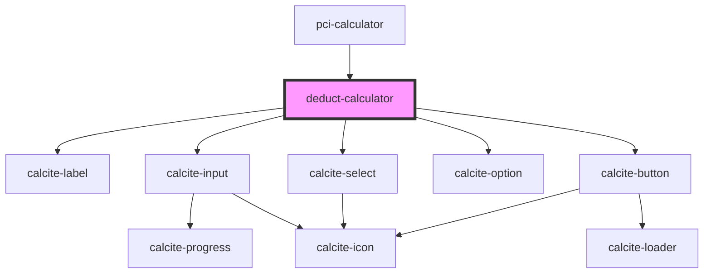

# pci-calculator

<!-- Auto Generated Below -->

## Events

| Event                 | Description                                                          | Type                  |
| --------------------- | -------------------------------------------------------------------- | --------------------- |
| `deductValueComplete` | Emitted on demand when the user clicks to calculate the deduct value | `CustomEvent<string>` |

## Dependencies

### Used by

 - [pci-calculator](../pci-calculator)

### Depends on

- calcite-label
- calcite-input
- calcite-select
- calcite-option
- calcite-button

### Graph

----------------------------------------------

*Built with [StencilJS](https://stenciljs.com/)*
