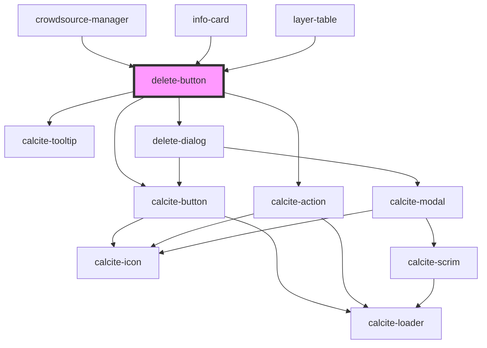

# delete-button

<!-- Auto Generated Below -->

## Properties

| Property       | Attribute       | Description                                                                                                                               | Type                   | Default     |
| -------------- | --------------- | ----------------------------------------------------------------------------------------------------------------------------------------- | ---------------------- | ----------- |
| `buttonType`   | `button-type`   | ButtonType (button \| action): Support usage as action or button                                                                          | `"action" \| "button"` | `"button"`  |
| `deleteDialog` | `delete-dialog` | calcite-modal: Use this prop when using the button within a parent like a dropdown that would constrain the modal and that is not desired | `any`                  | `undefined` |
| `disabled`     | `disabled`      | boolean: This overrides internal enable/disable logic that is based on checks if the layer supports delete                                | `boolean`              | `false`     |
| `icon`         | `icon`          | string: The icon to display in the component                                                                                              | `string`               | `undefined` |
| `ids`          | --              | number[]: The ids that would be deleted                                                                                                   | `any[]`                | `[]`        |
| `layer`        | --              | esri/views/layers/FeatureLayer: https://developers.arcgis.com/javascript/latest/api-reference/esri-layers-FeatureLayer.html               | `FeatureLayer`         | `undefined` |

## Events

| Event           | Description                                       | Type                                         |
| --------------- | ------------------------------------------------- | -------------------------------------------- |
| `editsComplete` | Emitted on demand when features have been deleted | `CustomEvent<"add" \| "delete" \| "update">` |

## Dependencies

### Used by

 - [crowdsource-manager](../crowdsource-manager)
 - [info-card](../info-card)
 - [layer-table](../layer-table)

### Depends on

- calcite-button
- calcite-action
- calcite-tooltip
- [delete-dialog](../delete-dialog)

### Graph

----------------------------------------------

*Built with [StencilJS](https://stenciljs.com/)*
