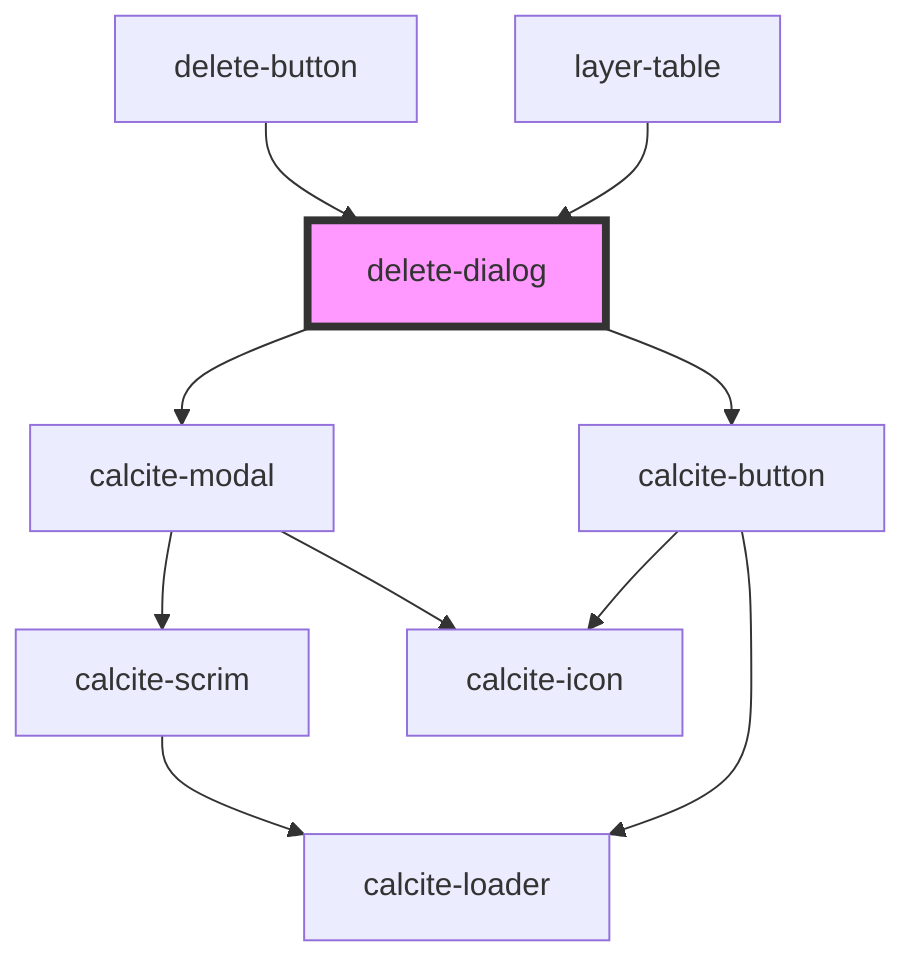

# delete-dialog

<!-- Auto Generated Below -->

## Properties

| Property | Attribute | Description                                                                                                                 | Type           | Default     |
| -------- | --------- | --------------------------------------------------------------------------------------------------------------------------- | -------------- | ----------- |
| `ids`    | --        | number[]: The ids that would be deleted                                                                                     | `any[]`        | `[]`        |
| `layer`  | --        | esri/views/layers/FeatureLayer: https://developers.arcgis.com/javascript/latest/api-reference/esri-layers-FeatureLayer.html | `FeatureLayer` | `undefined` |
| `open`   | `open`    | boolean: When true the delete dialog will be displayed                                                                      | `boolean`      | `false`     |

## Events

| Event               | Description                                       | Type                                         |
| ------------------- | ------------------------------------------------- | -------------------------------------------- |
| `deleteDialogClose` | Emitted on demand when features have been deleted | `CustomEvent<void>`                          |
| `editsComplete`     | Emitted on demand when features have been deleted | `CustomEvent<"add" \| "delete" \| "update">` |

## Dependencies

### Used by

 - [delete-button](../delete-button)
 - [layer-table](../layer-table)

### Depends on

- calcite-modal
- calcite-button

### Graph

----------------------------------------------

*Built with [StencilJS](https://stenciljs.com/)*
