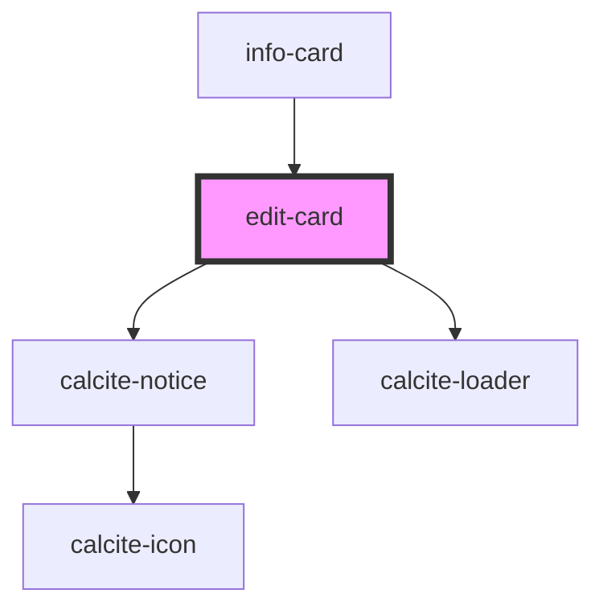

# edit-card

<!-- Auto Generated Below -->

## Properties

| Property             | Attribute              | Description                                                                                               | Type        | Default     |
| -------------------- | ---------------------- | --------------------------------------------------------------------------------------------------------- | ----------- | ----------- |
| `enableEditGeometry` | `enable-edit-geometry` | When true the geometry of the current feature will be editable                                            | `boolean`   | `false`     |
| `graphicIndex`       | `graphic-index`        | The index of the current graphic                                                                          | `number`    | `0`         |
| `graphics`           | --                     | esri/Graphic[]: https://developers.arcgis.com/javascript/latest/api-reference/esri-Graphic.html           | `Graphic[]` | `undefined` |
| `mapView`            | --                     | esri/views/MapView: https://developers.arcgis.com/javascript/latest/api-reference/esri-views-MapView.html | `MapView`   | `undefined` |
| `open`               | `open`                 | When true the component is displayed                                                                      | `boolean`   | `false`     |

## Events

| Event             | Description                                                                                                                                       | Type                     |
| ----------------- | ------------------------------------------------------------------------------------------------------------------------------------------------- | ------------------------ |
| `closeEdit`       | Emitted on demand when the Editor widget should be closed                                                                                         | `CustomEvent<void>`      |
| `editsComplete`   | Emitted on demand when edits are completed on current edit layer                                                                                  | `CustomEvent<void>`      |
| `refreshGraphics` | Emitted on demand when the editor is closed to handle things like attachment updates that don't fire the standard edit update event when complete | `CustomEvent<Graphic[]>` |

## Dependencies

### Used by

 - [info-card](../info-card)

### Depends on

- calcite-notice
- calcite-loader

### Graph

----------------------------------------------

*Built with [StencilJS](https://stenciljs.com/)*
