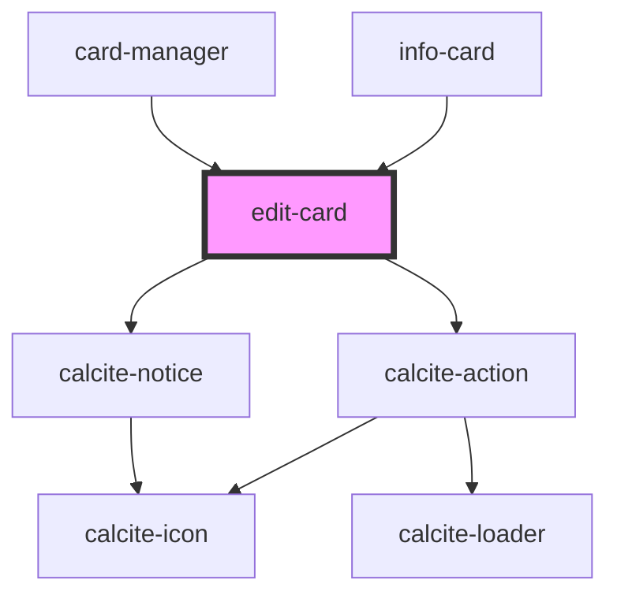

# edit-card

<!-- Auto Generated Below -->

## Properties

| Property       | Attribute       | Description                                                                                               | Type                                | Default            |
| -------------- | --------------- | --------------------------------------------------------------------------------------------------------- | ----------------------------------- | ------------------ |
| `editMode`     | `edit-mode`     | esri/Graphic[]: https://developers.arcgis.com/javascript/latest/api-reference/esri-Graphic.html           | `EEditMode.ADD \| EEditMode.UPDATE` | `EEditMode.UPDATE` |
| `graphicIndex` | `graphic-index` | The index of the current graphic                                                                          | `number`                            | `0`                |
| `graphics`     | --              | esri/Graphic[]: https://developers.arcgis.com/javascript/latest/api-reference/esri-Graphic.html           | `Graphic[]`                         | `undefined`        |
| `mapView`      | --              | esri/views/MapView: https://developers.arcgis.com/javascript/latest/api-reference/esri-views-MapView.html | `MapView`                           | `undefined`        |
| `open`         | `open`          | When true the component is displayed                                                                      | `boolean`                           | `false`            |

## Events

| Event       | Description                                               | Type                |
| ----------- | --------------------------------------------------------- | ------------------- |
| `closeEdit` | Emitted on demand when the Editor widget should be closed | `CustomEvent<void>` |

## Dependencies

### Used by

 - [card-manager](../card-manager)
 - [info-card](../info-card)

### Depends on

- calcite-notice
- calcite-action

### Graph

```mermaid
graph TD;
  edit-card --> calcite-notice
  edit-card --> calcite-action
  calcite-notice --> calcite-icon
  calcite-action --> calcite-loader
  calcite-action --> calcite-icon
  card-manager --> edit-card
  info-card --> edit-card
  style edit-card fill:#f9f,stroke:#333,stroke-width:4px
```

----------------------------------------------

*Built with [StencilJS](https://stenciljs.com/)*
