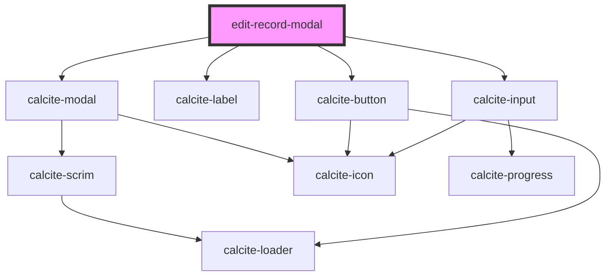

# edit-record-modal

<!-- Auto Generated Below -->

## Properties

| Property | Attribute | Description                          | Type      | Default |
| -------- | --------- | ------------------------------------ | --------- | ------- |
| `open`   | `open`    | When true the component is displayed | `boolean` | `false` |

## Dependencies

### Depends on

- calcite-modal
- calcite-label
- calcite-button
- calcite-input

### Graph

----------------------------------------------

*Built with [StencilJS](https://stenciljs.com/)*
