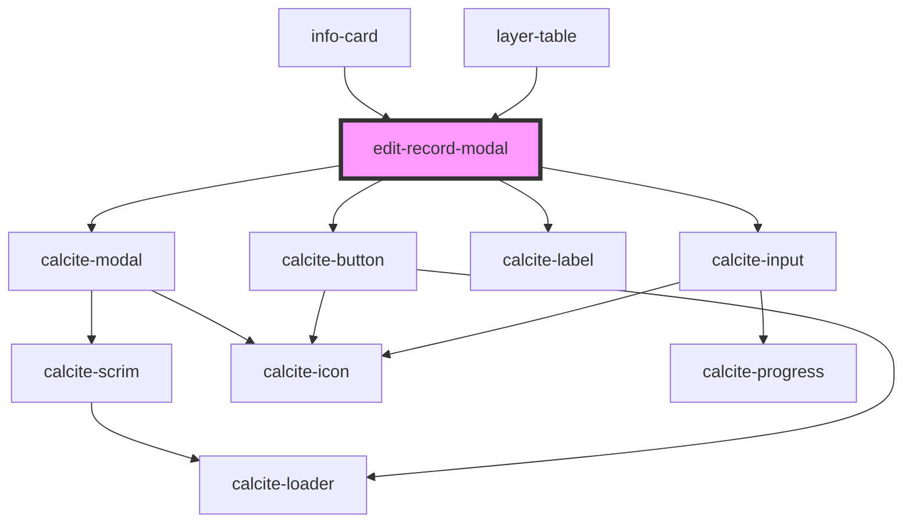

# edit-record-modal

<!-- Auto Generated Below -->

## Properties

| Property  | Attribute | Description                                                                                               | Type      | Default     |
| --------- | --------- | --------------------------------------------------------------------------------------------------------- | --------- | ----------- |
| `graphic` | --        | esri/Graphic: https://developers.arcgis.com/javascript/latest/api-reference/esri-Graphic.html             | `Graphic` | `undefined` |
| `mapView` | --        | esri/views/MapView: https://developers.arcgis.com/javascript/latest/api-reference/esri-views-MapView.html | `MapView` | `undefined` |
| `open`    | `open`    | When true the component is displayed                                                                      | `boolean` | `false`     |

## Events

| Event         | Description                                   | Type                |
| ------------- | --------------------------------------------- | ------------------- |
| `modalClosed` | Emitted on demand when a buffer is generated. | `CustomEvent<void>` |
| `modalOpened` | Emitted on demand when a buffer is generated. | `CustomEvent<void>` |

## Dependencies

### Used by

 - [info-card](../info-card)
 - [layer-table](../layer-table)

### Depends on

- calcite-modal
- calcite-button
- calcite-label
- calcite-input

### Graph

----------------------------------------------

*Built with [StencilJS](https://stenciljs.com/)*
