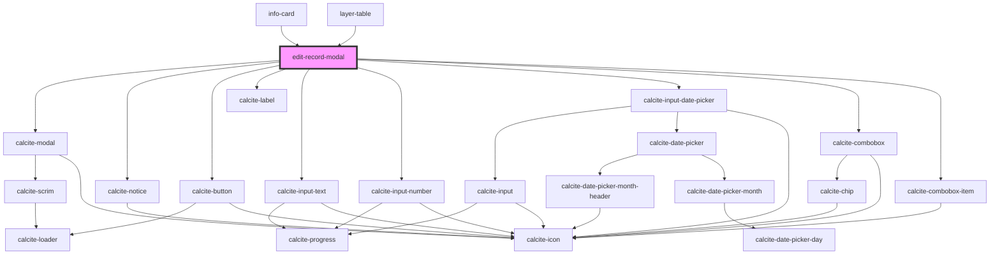

# edit-record-modal

<!-- Auto Generated Below -->

## Properties

| Property       | Attribute       | Description                                                                                                                                                                                       | Type                                  | Default            |
| -------------- | --------------- | ------------------------------------------------------------------------------------------------------------------------------------------------------------------------------------------------- | ------------------------------------- | ------------------ |
| `editMode`     | `edit-mode`     | "MULTI" \| "SINGLE": "SINGLE" edit mode is intended to be used to edit a single existing feature                     "MULTI" edit mode is intended to apply edits across a collection of features | `EEditMode.MULTI \| EEditMode.SINGLE` | `EEditMode.SINGLE` |
| `graphicIndex` | `graphic-index` | The index of the current graphic                                                                                                                                                                  | `number`                              | `0`                |
| `graphics`     | --              | esri/Graphic[]: https://developers.arcgis.com/javascript/latest/api-reference/esri-Graphic.html                                                                                                   | `Graphic[]`                           | `undefined`        |
| `mapView`      | --              | esri/views/MapView: https://developers.arcgis.com/javascript/latest/api-reference/esri-views-MapView.html                                                                                         | `MapView`                             | `undefined`        |
| `open`         | `open`          | When true the component is displayed                                                                                                                                                              | `boolean`                             | `false`            |

## Events

| Event         | Description                                | Type                |
| ------------- | ------------------------------------------ | ------------------- |
| `modalClosed` | Emitted on demand when the modal is closed | `CustomEvent<void>` |
| `modalOpened` | Emitted on demand when the modal is opened | `CustomEvent<void>` |

## Dependencies

### Used by

 - [info-card](../info-card)
 - [layer-table](../layer-table)

### Depends on

- calcite-modal
- calcite-notice
- calcite-button
- calcite-label
- calcite-input-text
- calcite-input-number
- calcite-input-date-picker
- calcite-combobox
- calcite-combobox-item

### Graph

----------------------------------------------

*Built with [StencilJS](https://stenciljs.com/)*
