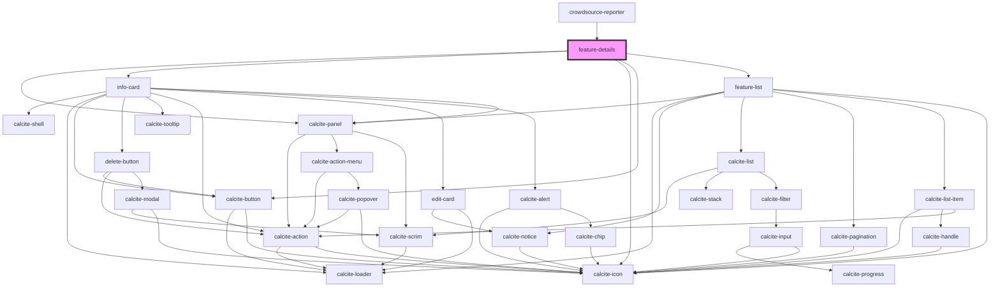

# feature-details

<!-- Auto Generated Below -->

## Properties

| Property           | Attribute | Description                                                                                               | Type                | Default     |
| ------------------ | --------- | --------------------------------------------------------------------------------------------------------- | ------------------- | ----------- |
| `graphics`         | --        | esri/Graphic: https://developers.arcgis.com/javascript/latest/api-reference/esri-Graphic.html             | `Graphic[]`         | `undefined` |
| `layerItemsHash`   | --        | ILayerItemsHash: LayerDetailsHash for each layer in the map                                               | `ILayerItemsHash`   | `undefined` |
| `mapView`          | --        | esri/views/MapView: https://developers.arcgis.com/javascript/latest/api-reference/esri-views-MapView.html | `MapView`           | `undefined` |
| `reportingOptions` | --        | IReportingOptions: Key options for reporting                                                              | `IReportingOptions` | `undefined` |

## Events

| Event                    | Description                                                       | Type                                                                         |
| ------------------------ | ----------------------------------------------------------------- | ---------------------------------------------------------------------------- |
| `commentSelect`          | Emitted on demand when comment is selected using the feature-list | `CustomEvent<Graphic>`                                                       |
| `featureSelectionChange` | Emitted on demand when the selected index changes                 | `CustomEvent<{ selectedFeature: Graphic[]; selectedFeatureIndex: number; }>` |
| `loadingStatus`          | Emitted on demand when like or dislike button is clicked          | `CustomEvent<boolean>`                                                       |

## Methods

### `back() => Promise<void>`

Go to the previous feature in the features widget

#### Returns

Type: `Promise<void>`

### `next() => Promise<void>`

Go to the next feature in the features widget

#### Returns

Type: `Promise<void>`

### `refresh(graphic?: __esri.Graphic) => Promise<void>`

Refresh the features comments which will fetch like, dislike and update the component

#### Parameters

| Name      | Type      | Description |
| --------- | --------- | ----------- |
| `graphic` | `Graphic` |             |

#### Returns

Type: `Promise<void>`

Promise that resolves when the operation is complete

### `toggleListView() => Promise<void>`

Toggle the visibility of the features list view

#### Returns

Type: `Promise<void>`

## Dependencies

### Used by

 - [crowdsource-reporter](../crowdsource-reporter)

### Depends on

- calcite-panel
- [info-card](../info-card)
- calcite-icon
- calcite-button
- [feature-list](../feature-list)

### Graph

----------------------------------------------

*Built with [StencilJS](https://stenciljs.com/)*
