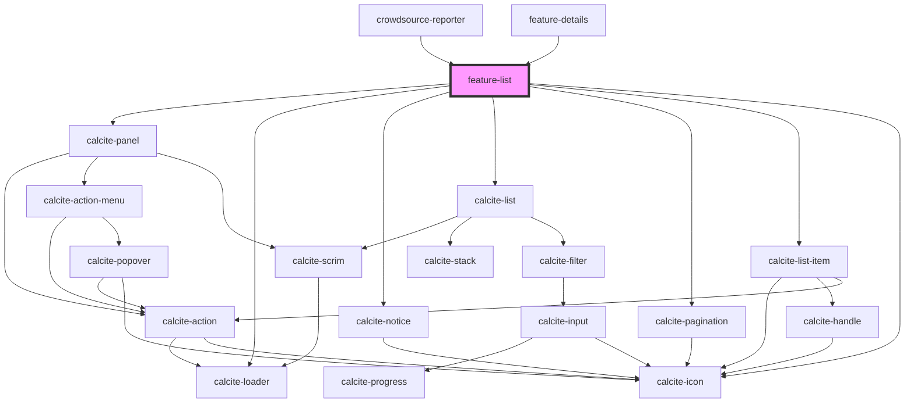

# feature-list

<!-- Auto Generated Below -->

## Properties

| Property             | Attribute               | Description                                                                                                                                          | Type                 | Default     |
| -------------------- | ----------------------- | ---------------------------------------------------------------------------------------------------------------------------------------------------- | -------------------- | ----------- |
| `highlightOnHover`   | `highlight-on-hover`    | boolean: Highlight feature on map optional (default false) boolean to indicate if we should highlight when hover on Feature in list                  | `boolean`            | `false`     |
| `highlightOnMap`     | `highlight-on-map`      | boolean: Highlight feature on map optional (default false) boolean to indicate if we should highlight and zoom to the extent of the feature geometry | `boolean`            | `false`     |
| `mapView`            | --                      | esri/views/View: https://developers.arcgis.com/javascript/latest/api-reference/esri-views-MapView.html                                               | `MapView`            | `undefined` |
| `noFeaturesFoundMsg` | `no-features-found-msg` | string: Message to be displayed when features are not found                                                                                          | `string`             | `undefined` |
| `pageSize`           | `page-size`             | number: Number features to be fetched per page, by default 100 features will be fetched                                                              | `number`             | `100`       |
| `selectedLayerId`    | `selected-layer-id`     | string: Layer id of the feature layer to show the list                                                                                               | `string`             | `undefined` |
| `showInitialLoading` | `show-initial-loading`  | boolean: Show initial loading indicator when creating list                                                                                           | `boolean`            | `true`      |
| `sortingInfo`        | --                      | ISortingInfo: Sorting field and order using which features list will be sorted                                                                       | `ISortingInfo`       | `undefined` |
| `textSize`           | `text-size`             | string(small/large): Controls the font size of the title                                                                                             | `"large" \| "small"` | `"large"`   |
| `whereClause`        | `where-clause`          | string: where clause to filter the features list                                                                                                     | `string`             | `undefined` |

## Events

| Event           | Description                                               | Type                   |
| --------------- | --------------------------------------------------------- | ---------------------- |
| `featureSelect` | Emitted on demand when feature is selected using the list | `CustomEvent<Graphic>` |

## Methods

### `refresh() => Promise<void>`

Refresh the feature list which will fetch the latest features and update the features list

#### Returns

Type: `Promise<void>`

Promise that resolves when the operation is complete

## Dependencies

### Used by

 - [crowdsource-reporter](../crowdsource-reporter)
 - [feature-details](../feature-details)

### Depends on

- calcite-panel
- calcite-loader
- calcite-notice
- calcite-list
- calcite-pagination
- calcite-list-item
- calcite-icon

### Graph

----------------------------------------------

*Built with [StencilJS](https://stenciljs.com/)*
