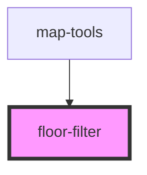

# floor-filter

<!-- Auto Generated Below -->

## Properties

| Property            | Attribute | Description                                                                                                                                 | Type          | Default     |
| ------------------- | --------- | ------------------------------------------------------------------------------------------------------------------------------------------- | ------------- | ----------- |
| `enabled`           | `enabled` | boolean: when true the Floor Filter widget will be available                                                                                | `boolean`     | `undefined` |
| `floorFilterWidget` | --        | esri/widgets/FloorFilter: https://developers.arcgis.com/javascript/latest/api-reference/esri-widgets-FloorFilter.html  FloorFilter instance | `FloorFilter` | `undefined` |
| `mapView`           | --        | esri/views/View: https://developers.arcgis.com/javascript/latest/api-reference/esri-views-MapView.html                                      | `MapView`     | `undefined` |

## Events

| Event             | Description                                    | Type                  |
| ----------------- | ---------------------------------------------- | --------------------- |
| `facilityChanged` | Emitted on demand when the Facility is changed | `CustomEvent<string>` |
| `levelChanged`    | Emitted on demand when the Level is changed    | `CustomEvent<string>` |
| `siteChanged`     | Emitted on demand when the Site is changed     | `CustomEvent<string>` |

## Dependencies

### Used by

 - [map-tools](../map-tools)

### Graph

----------------------------------------------

*Built with [StencilJS](https://stenciljs.com/)*
