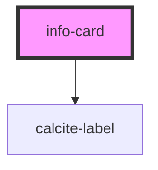

# info-card

<!-- Auto Generated Below -->

## Properties

| Property    | Attribute    | Description                                                      | Type              | Default |
| ----------- | ------------ | ---------------------------------------------------------------- | ----------------- | ------- |
| `cardTitle` | `card-title` | string: the components title                                     | `string`          | `""`    |
| `values`    | --           | IInfoCardValues: key value pairs to show in the components table | `IInfoCardValues` | `{}`    |

## Dependencies

### Depends on

- calcite-label

### Graph

----------------------------------------------

*Built with [StencilJS](https://stenciljs.com/)*
