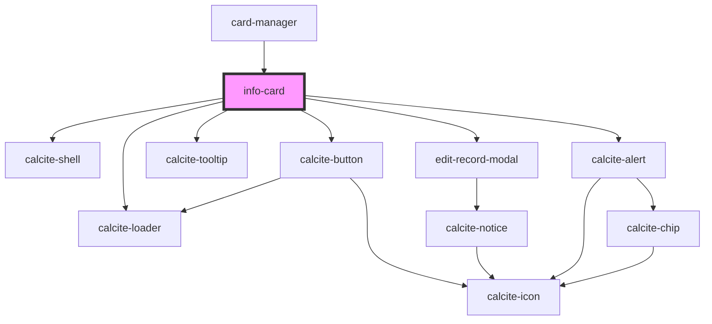

# info-card

<!-- Auto Generated Below -->

## Properties

| Property    | Attribute    | Description                                                                                               | Type        | Default     |
| ----------- | ------------ | --------------------------------------------------------------------------------------------------------- | ----------- | ----------- |
| `graphics`  | --           | esri/Graphic: https://developers.arcgis.com/javascript/latest/api-reference/esri-Graphic.html             | `Graphic[]` | `undefined` |
| `isLoading` | `is-loading` | boolean: when true a loading indicator will be shown                                                      | `boolean`   | `false`     |
| `mapView`   | --           | esri/views/MapView: https://developers.arcgis.com/javascript/latest/api-reference/esri-views-MapView.html | `MapView`   | `undefined` |

## Methods

### `getSelectedFeature() => Promise<any>`

Get the current selected feature from the Features widget

#### Returns

Type: `Promise<any>`

Promise resolving with the current feature

## Dependencies

### Used by

 - [card-manager](../card-manager)

### Depends on

- calcite-shell
- calcite-loader
- calcite-button
- calcite-tooltip
- [edit-record-modal](../edit-record-modal)
- calcite-alert

### Graph

----------------------------------------------

*Built with [StencilJS](https://stenciljs.com/)*
