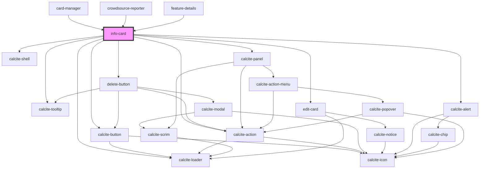

# info-card

<!-- Auto Generated Below -->

## Properties

| Property             | Attribute              | Description                                                                                               | Type        | Default      |
| -------------------- | ---------------------- | --------------------------------------------------------------------------------------------------------- | ----------- | ------------ |
| `allowEditing`       | `allow-editing`        | boolean: If true will show edit button                                                                    | `boolean`   | `true`       |
| `enableEditGeometry` | `enable-edit-geometry` | When true the geometry of the current feature will be editable                                            | `boolean`   | `false`      |
| `graphics`           | --                     | esri/Graphic: https://developers.arcgis.com/javascript/latest/api-reference/esri-Graphic.html             | `Graphic[]` | `undefined`  |
| `highlightEnabled`   | `highlight-enabled`    | boolean: If true will highlights the features on map using Features Widget                                | `boolean`   | `true`       |
| `isLoading`          | `is-loading`           | boolean: when true a loading indicator will be shown                                                      | `boolean`   | `false`      |
| `isMobile`           | `is-mobile`            | When true the component will render an optimized view for mobile devices                                  | `boolean`   | `undefined`  |
| `mapView`            | --                     | esri/views/MapView: https://developers.arcgis.com/javascript/latest/api-reference/esri-views-MapView.html | `MapView`   | `undefined`  |
| `paginationEnabled`  | `pagination-enabled`   | boolean: If true will show the pagination for multiple features                                           | `boolean`   | `true`       |
| `position`           | `position`             | string: Set the position of the feature info                                                              | `string`    | `'absolute'` |

## Events

| Event              | Description                                       | Type                                                                         |
| ------------------ | ------------------------------------------------- | ---------------------------------------------------------------------------- |
| `popupClosed`      | Emitted on demand when the popup is closed        | `CustomEvent<void>`                                                          |
| `selectionChanged` | Emitted on demand when the selected index changes | `CustomEvent<{ selectedFeature: Graphic[]; selectedFeatureIndex: number; }>` |

## Methods

### `back() => Promise<void>`

Go to the previous feature in the features widget

#### Returns

Type: `Promise<void>`

### `getSelectedFeature() => Promise<any>`

Get the current selected feature from the Features widget

#### Returns

Type: `Promise<any>`

Promise resolving with the current feature

### `next() => Promise<void>`

Go to the next feature in the features widget

#### Returns

Type: `Promise<void>`

### `refresh() => Promise<any>`

Refresh the feature info

#### Returns

Type: `Promise<any>`

Promise when complete

### `toggleListView() => Promise<void>`

Toggle the visibility of the features list view

#### Returns

Type: `Promise<void>`

### `updateCurrentGraphic(selectedGraphic: __esri.Graphic) => Promise<void>`

update the current graphics to the features widget

#### Parameters

| Name              | Type      | Description |
| ----------------- | --------- | ----------- |
| `selectedGraphic` | `Graphic` |             |

#### Returns

Type: `Promise<void>`

## Dependencies

### Used by

 - [card-manager](../card-manager)
 - [crowdsource-reporter](../crowdsource-reporter)
 - [feature-details](../feature-details)

### Depends on

- calcite-shell
- calcite-loader
- calcite-button
- [delete-button](../delete-button)
- calcite-tooltip
- calcite-action
- [edit-card](../edit-card)
- calcite-alert
- calcite-panel

### Graph

----------------------------------------------

*Built with [StencilJS](https://stenciljs.com/)*
