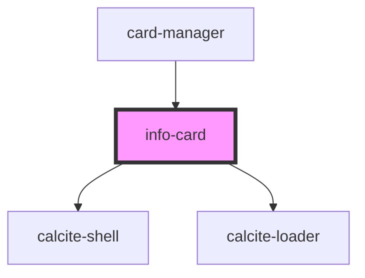

# info-card

<!-- Auto Generated Below -->

## Properties

| Property    | Attribute    | Description                                                                                               | Type      | Default     |
| ----------- | ------------ | --------------------------------------------------------------------------------------------------------- | --------- | ----------- |
| `graphic`   | --           | esri/Graphic: https://developers.arcgis.com/javascript/latest/api-reference/esri-Graphic.html             | `Graphic` | `undefined` |
| `isLoading` | `is-loading` | boolean: when true a loading indicator will be shown                                                      | `boolean` | `false`     |
| `mapView`   | --           | esri/views/MapView: https://developers.arcgis.com/javascript/latest/api-reference/esri-views-MapView.html | `MapView` | `undefined` |

## Dependencies

### Used by

 - [card-manager](../card-manager)

### Depends on

- calcite-shell
- calcite-loader

### Graph

----------------------------------------------

*Built with [StencilJS](https://stenciljs.com/)*
