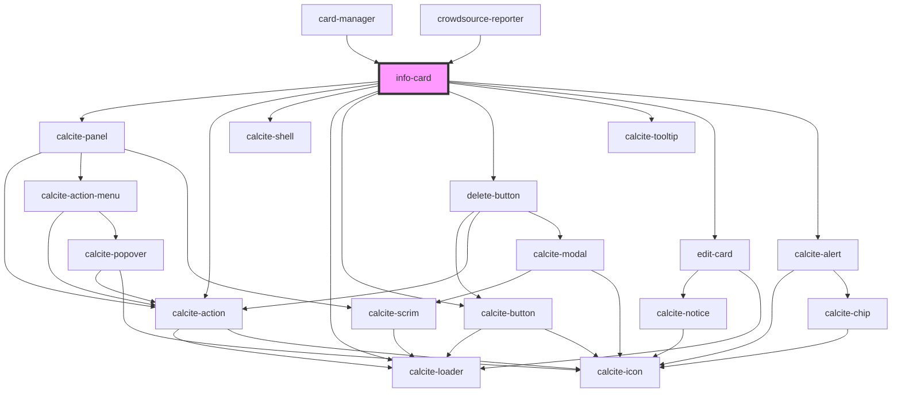

# info-card

<!-- Auto Generated Below -->

## Properties

| Property                  | Attribute                     | Description                                                                                                        | Type        | Default     |
| ------------------------- | ----------------------------- | ------------------------------------------------------------------------------------------------------------------ | ----------- | ----------- |
| `allowEditing`            | `allow-editing`               | boolean: If true will show edit button                                                                             | `boolean`   | `true`      |
| `graphics`                | --                            | esri/Graphic: https://developers.arcgis.com/javascript/latest/api-reference/esri-Graphic.html                      | `Graphic[]` | `undefined` |
| `isLoading`               | `is-loading`                  | boolean: when true a loading indicator will be shown                                                               | `boolean`   | `false`     |
| `isMobile`                | `is-mobile`                   | When true the component will render an optimized view for mobile devices                                           | `boolean`   | `undefined` |
| `mapView`                 | --                            | esri/views/MapView: https://developers.arcgis.com/javascript/latest/api-reference/esri-views-MapView.html          | `MapView`   | `undefined` |
| `zoomAndScrollToSelected` | `zoom-and-scroll-to-selected` | boolean: When true the selected feature will zoomed to in the map and the row will be scrolled to within the table | `boolean`   | `undefined` |

## Events

| Event              | Description                                       | Type                     |
| ------------------ | ------------------------------------------------- | ------------------------ |
| `popupClosed`      | Emitted on demand when the popup is closed        | `CustomEvent<void>`      |
| `selectionChanged` | Emitted on demand when the selected index changes | `CustomEvent<Graphic[]>` |

## Methods

### `getSelectedFeature() => Promise<any>`

Get the current selected feature from the Features widget

#### Returns

Type: `Promise<any>`

Promise resolving with the current feature

## Dependencies

### Used by

 - [card-manager](../card-manager)
 - [crowdsource-reporter](../crowdsource-reporter)

### Depends on

- calcite-panel
- calcite-action
- calcite-shell
- calcite-loader
- calcite-button
- [delete-button](../delete-button)
- calcite-tooltip
- [edit-card](../edit-card)
- calcite-alert

### Graph

----------------------------------------------

*Built with [StencilJS](https://stenciljs.com/)*
