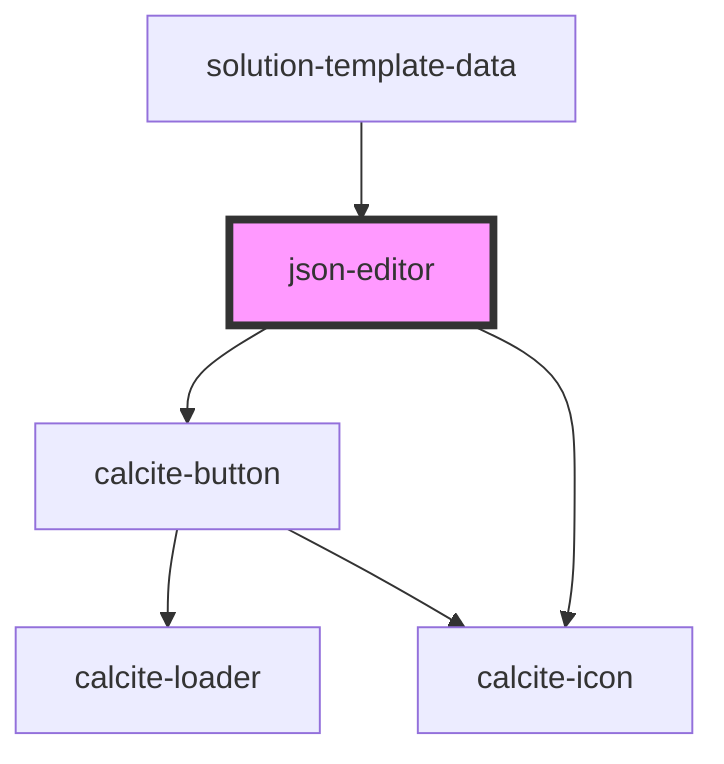

# json-editor

<!-- Auto Generated Below -->

## Properties

| Property                  | Attribute      | Description                                                                                   | Type         | Default     |
| ------------------------- | -------------- | --------------------------------------------------------------------------------------------- | ------------ | ----------- |
| `hasErrors`               | `has-errors`   | Contains a public value to indicate if the model has any errors that would prevent saving it. | `boolean`    | `false`     |
| `instanceId` _(required)_ | `instance-id`  | Contains the public id for this component.                                                    | `string`     | `undefined` |
| `model`                   | --             | Contains the public model for this component.                                                 | `ITextModel` | `undefined` |
| `translations`            | `translations` | Contains the translations for this component.                                                 | `any`        | `{}`        |
| `value`                   | `value`        | Contains the public value for this component.                                                 | `any`        | `undefined` |

## Events

| Event             | Description | Type               |
| ----------------- | ----------- | ------------------ |
| `jsonEditorSaved` |             | `CustomEvent<any>` |

## Dependencies

### Used by

 - [solution-template-data](../solution-template-data)

### Depends on

- calcite-button
- calcite-icon

### Graph

----------------------------------------------

*Built with [StencilJS](https://stenciljs.com/)*
